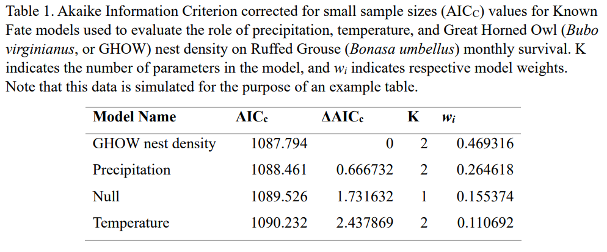

```{r setup, include=FALSE}
knitr::opts_chunk$set(echo = TRUE)
```

```{r, echo=FALSE, warning=FALSE}
library(knitr)
opts_chunk$set(tidy.opts=list(width.cutoff=60),tidy=TRUE)
```

```{css, echo=FALSE}
.scroll-200 {
  max-height: 200px;
  max-width: 100%;
  overflow-x: auto
  overflow-y: auto;
  background-color: inherit;
}

```

```{r echo=FALSE, include=FALSE}
#install.packages("RMark")
library(RMark)
#install.packages("bookdown")
library(bookdown)
library(ggplot2)
#install.packages('curl')
library(curl)
#install.packages("kableExtra")
library(kableExtra)
```

# Figure formatting guidelines

Formatting guidelines for figures generally follow those of the Journal of Wildlife Management. All figure text, including axis titles, axis labels, and legend text, should be in Arial 12 pt font (note that Calibri is the default and is not acceptable). The figure should be presented in black and white only and all grid lines should be removed. Axis titles may be in bold, but all other text in standard font style. Capitalize the first word of the axis title with all other words in lower case unless a proper noun. Remove all outer borders from the figure and the legend. There should be no figure title. If multiple colors (in grayscale) are included in the figure, add a legend corresponding to these colors.

If figures are embedded in a Word document, they should be accompanied by a caption, which includes a) the figure name (e.g. Figure 1) and b) a description of the data depicted. Best practice is to ensure that the caption guidelines are detailed enough that readers can understand the figure without referencing the paper (or, in this case, your assignment write up). Figure captions are typically placed below the figure.


# Table formatting guidelines
As for figures, tables in WLE 411 generally follow formatting guidelines for the Journal of Wildlife Management. Formatted tables should be constructed in Microsoft Word and not Excel. Each column should have a bolded heading describing the contents of the column (e.g. "Model Name"). Column headers should be either in plain English or use common mathematical symbols (e.g. "Number of parameters" or "K" instead of "npar"). Your table should be formatted in 12-point Times New Roman font. The table should have no vertical lines, and only 3 horizontal lines: 1) above the header row, 2) below the header row, and 3) below the final row of the table. Notice that column headings and labels for individual observations are left-justified, whereas values in the data field of the table (the things you actually measured and/or estimated) are right justified. 

You should also provide a title for your table. Titles include a) the name of the table (e.g. Table 1), and b) a description of the data provided. As with figures, table titles should be detailed enough that the reader can understand the table without referencing the assignment write up. Table titles are typically placed above the table.


