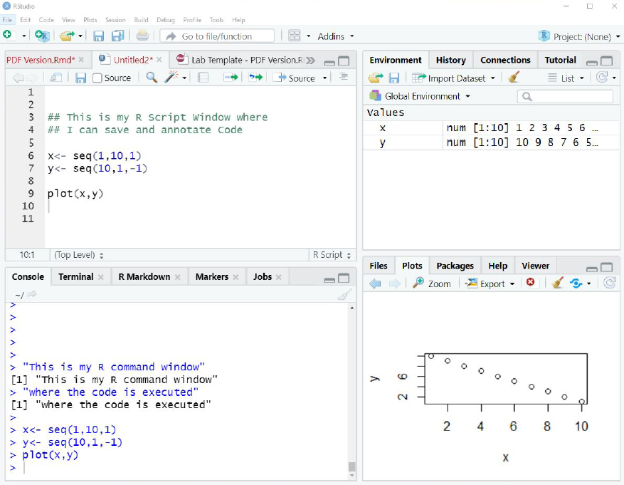

```{r setup, include=FALSE, echo=FALSE}
knitr::opts_chunk$set(echo = TRUE)
```

```{r, echo=FALSE, warning=FALSE, error=FALSE}
library(knitr)
opts_chunk$set(tidy.opts=list(width.cutoff=60),tidy=TRUE)
```

```{css, echo=FALSE}
.scroll-200 {
  max-height: 200px;
  max-width: 100%;
  overflow-x: auto
  overflow-y: auto;
  background-color: inherit;
}
```

```{r echo=FALSE, include=FALSE}
#install.packages("RMark")
library(RMark)
#install.packages("bookdown")
library(bookdown)
library(ggplot2)
#install.packages('curl')
library(curl)
#install.packages("kableExtra")
library(kableExtra)

cleanup(ask=FALSE)

```

# Introduction to the Lab Manual

  Welcome to the WLE 411 Wildlife Population Dynamics Lab Manual. During our first lab
period we’ll have gone through the course specs and reviewed the syllabus so you should
understand the overall structure and process of the course. With this Preface to the lab
manual, I want to walk you through the general mechanics of how each week’s lab will
function, how you’ll use the manual to work through each week’s exercises, and, in turn,
complete the assignments for each lab.
  In this lab course we’ll be working primarily with 2 programs: Microsoft Excel, which you
should be relatively familiar with, and Program R, which you may or may not have encountered
before. I’ve designed the labs for the semester such that we begin working primarily
in Excel and gradually introduce more materials in R, such that by the end of the course
we’ll be working almost exclusively in R.
  To hopefully help with continuity, I’ve structured every week’s lab as consistently as
possible so that the instructions contained in the manual should become familiar to you as
we progress through the semester. First, let's take a look at the general organizational layout of the labs. Then we’ll talk about different components of the lab exercises, and how you should approach completing each week’s lab assignments.

# Lab Manual Structure

  Each of the 10 labs contained in the manual will have a common organization, and share
the following elements.

## Table of Contents

  Each lab will begin with a table of contents that highlights the major and minor subject
headings for different parts of the lab. You’ll see that the sections and subsections are
numbered, and you should find that the TOC is hyperlinked, so you can click on a subsection
and be taken directly to it. A generic description of some of these sections that are common
to all the labs is provided below.

## Lab Overview

  I will try to give a very brief (normally one paragraph or so) setup for each lab before
we jump into the meat of things. These will be typically generic and might just set up the
context for the lab relative to what we’ve done in past weeks.

## Learning Objectives

  For every lab I think it’s important to highlight what I feel are the most important things
you’ll take away from that lab - these are the learning objectives. Usually there will be 3
or 4, and I try to keep the brief and general. They may focus on particular concepts (e.g. a
particular statistic), skills (e.g. how to use an R package) or more general knowledge.

## Lab Content

  This is not a named section, but rather comprises the bulk of each lab with sections and
subsections devoted to the specific subject matter of the day that will be largely unique
to each lab. For almost all labs, there will first be some relevant background materials to
provide context that is necessary to complete and interpret the results of your analyses.
That will be followed by the more step-by-step instructions for completing the lab, which
will involve one or more additional sections of the document.

## The Three Big Things You Should Have Learned Today

  I will close each lab with a summary of three key take-homes from the lab. Often these
will follow from the learning objectives, but even if they are repetitive I think its important to emphasize that the goal of what you’ve completed is to increase your knowledge. They will also tend to be components of the lab that will carry over to future weeks. If you read these three things and find they mean next to nothing to you, its probably a good sign that you should revisit those components of the lab.

## Assignment

  Following the lab instructions, you will find a section detailing the assignment for the
week, including the steps you’ll need to complete for the assignment and any details about
submission, grading expectations, etc. You should always refer to the course syllabus for
specifics about submitting your assignments, such as assignment due dates, as well as the
general grading for the course.

## Lab Appendix

  Following each lab you will find an Appendix that contains at least three subsections,
described below. Think of these as an epilogue to the lab - always worth your time to read,
but not absolutely necessary to get the full ‘story’ of the lab. They will generally be brief
and in some cases you may find the information they contain more useful than trying to
hunt through the full lab instructions, so I do recommend reading through them each week.

### Quick Reference for Important R Commands

  In this section, I will highlight a few key commands we used in R for the lab and how
they are implemented. These will be generic instructions, and in many cases may feature
commands that you’ll need to use for completing the homework assignments.

### For More Information

  Here, I will give any relevant links or citations to more advanced resources. I don’t expect you to follow through on these for this class or to complete your assignments. But, if
sometime down the road you find yourself trying to implement the methods we used as part
of a future class, job, graduate research, etc., I recommend going to these sources for greater depth of understanding on the subject.

### Bibliography

  As you read through each lab you’ll find some key words highlighted in bold. Normally
these are terms or phrases I think are either particularly important, or they are technical
terms you might not have been exposed to before. In general you should be able to infer their
meaning based on the context provided in the text, but if not I will give a more complete
definition in the Bibliography.

# Other Miscellaneous Elements
  Aside from the specific, reoccurring sections among each lab, you should find consistency
in how I present various elements throughout the manual. I’ll highlight a few of these below
that are going to be particularly important as you work through each lab.

## Equations {#eq1}

  Almost all of the labs will feature mathematical equations that represent various types of
models we will be implementing as we conduct exercises and analyses. Often, you will be
required to translate these equations into an Excel formula or R Script. They will always be
centered and numbered within each lab, for example:

Equation example:

\begin{equation}
 \label{eq:1}
  \bar{x}=\frac{1}{n} \sum_{i=0}^{n}x_i
\end{equation}

Which you should recognize as the general equation for an arithmetic mean, otherwise
known as an average. When I reference an equation in text, I will write something like
"Calculate the average of x using **_equation \textcolor{red}{\ref{eq:1}}_**, where the red number should be hyperlinked to the equation.

## R Code

I will get into this a bit more below in the Program R Introduction materials, but generally
you can expect all R code in the document to look as follows:

```{r eval=FALSE, echo=TRUE, warning=FALSE, error=FALSE, message=FALSE, tidy=TRUE, results='markup'}
Average <- mean(c(1, 2, 3, 4))
Average
```

Where the code will be distinguished from the rest of the handout by the gray background,
as above. You’ll find some different coloring of the text associated with the R code, which
corresponds to different classes of the various elements of the code. In general, the different colors are not terribly important for you at this stage. What is important is that you should know to copy and paste the code from the handout into your script - more on this below.

## R Code Output

Occasionally, I will have both the code and its output listed in the handouts. When I do
this, the code chunk will be followed by output text of some form, preceded by two hashtags
## as you see below. I will not always include the output from the code in the handouts,
but when I do you should check to see that your output in your R console matches the output
I’ve presented.

```{r eval=TRUE, echo=TRUE, warning=FALSE, error=FALSE, message=FALSE, tidy=TRUE, results='markup'}
Average <- mean(c(1, 2, 3, 4))
Average
```

## Sidebars

In many labs, I’ll have occasion to offer a brief aside to the lab exercise at various points. This may be to offer a more thorough explanation for a particular step in the analysis, or give a small amount of back-story. I’ll distinguish those cases with a sidebar, such as follows:

> **_Sidebar - This is what a sidebar will look like - _**I am a sidebar. I am
prominent and striking. My format says ‘Read Me’, but don’t get too distracted
by me because I am probably somewhat tangential to the task at hand!

I promise not to abuse the sidebars by introducing too many obscure pop culture references.

# Program R Introduction

The goal of the course is not to teach you how to use R per se, but rather to use R as
just one of the tools available to us to better understand the process of animal demographic
estimation. I want to acknowledge that right off the bat - as learning to use R proficiently
could be the subject of multiple semester-long courses.

With that said, I do hope you leave with more than just a passing familiarity of R, as I
think you’ll find having some comfort in a coding language beneficial regardless of where your career (and life in general) takes you. Programming languages are all around you, regardless of whether you realize it or not. They create the web pages and cell apps you interact with every day. They generate the visual content you see on news sites and social media. They are used to publish documents (including this one), analyze data, and generally speaking facilitate the way the world works. So aside from their practical application to the study of ecology and the management of fish and wildlife populations, coding has a much broader relevance to our daily lives as citizens of the planet.

As we go through each week’s exercise you’ll be asked to apply R, possibly carrying through
at least some knowledge from previous labs, but I will generally make it as cookbook as
possible by providing you directly with the majority of code you’ll need to complete each
lab. What follows is intended as a general ‘how to guide’ that you should use for interfacing
with R and RStudio as we move through the semester.

## Program R and RStudio

R is a commonly used and exceptionally powerful software for completing an almost limitless
suite of tasks. It can be used for statistical analysis, data management, graphing, GIS,
writing (again, I wrote this Lab Manual in R), and analyzing demographic data, among
many other possibilities. R is an open source software that can be downloaded and used by
anyone free of charge.

If you are working on your own computer, you will need to download the most recent
version [\textcolor{blue}{which is available at this link}](https://cloud.r-project.org/).

We will work in R via a secondary program, RStudio, which will allow us to write scripts
where we can save, organize, and annotate our code, and interface with the R software to
execute the code, along with some other useful features. RStudio is also a free software and
it works in conjunction with R (i.e. you need to have them both installed on your computer
to use RStudio).

If you are working on your own computer, you will need to download the most recent
version of RStudio [\textcolor{blue}{which is available at this link}](https://posit.co/download/rstudio-desktop/).

R is a command line based program, where you enter prompts in the form of written command
statements in order to perform operations, rather than the point-and-click operations
of many other software you might be used to. The benefit to this is that you can complete
just about any operation you can dream of, rather than being confined by the pre-set options
that the software’s developers designed when they wrote the program. The downside is that
correctly coding programs in R requires that you understand the programming language and
enter the appropriate command(s) correctly in order to perform the operation you would like
to accomplish. This is basically equivalent to learning a new spoken language, and so there
is a very large learning curve inherent to working effectively in R.

Fortunately, there is a huge volume of online resources available for learning the language
and troubleshooting your code. Pretty much any problem you run into can be answered with
some clever web searching, and in fact some would say that being good at R is synonymous
with being good at Googling. Today we will work through a few basic operations just to
introduce you the use of R and RStudio, make sure you’ve got them installed correctly if
using your own computer, and set the stage for completing labs and assignments during the
rest of the semester.

## A primer to working in RStudio
First, open the RStudio software. It should look something like Figure 1 below, with
4 different panes, or windows, which each correspond with different elements of the RStudio
environment. There are obviously a TON of different options available, but I’ll just
summarize the key elements below.

### The toolbar
Along the top of the RStuido Graphical User Interface (GUI), you’ll see a toolbar that should look familiar to many software you’ve used in the past, with standard options like ‘File’, ‘Edit’, ‘View’, etc. Also notice some quick-link icons like a computer disk to save, options to print, create a new file, etc. Most of these are fairly intuitive.



### The script window

The pane in the upper left is where we can type the code that constitutes our analysis,
and that can be saved as a R file just like you might save a word document or any other
generic file type. It is basically a text editor for your R analysis. Anything written into
this window will be read as code to be executed by R UNLESS you preface it on the same
line with a hashtag (#). As you read through each lab, you’ll see instances where I use ##
within chunks of code as notes explaining elements of that code.

Similarly, as you work through each lab, you can make use of the #s to annotate your
code, or make notes to yourself, as you produce your script for the lab. I’ll explain this and give an example below. But overall, think of the Script Window as your primary workhorse
for completing an exercise.

### The R console window

Below the Script Window you should see the R console. This is where the code you write
is actually executed by R. If you highlight a piece of code in the Script Window and click
on the ‘Run’ command in the upper left corner, it will be pasted to the R console, the code
executed, and any output inherent to the commands in the code will be printed, including
error messages.

Importantly, you need to have R installed on your computer, but it does not need to be
open and running on its own. RStudio maintains a connection to R and executes your code
for you.

You will also notice that any comments in your script preceded by # will be sent to the
R console, but it does not execute them as code.

### The environment window

In the upper right corner you’ll find the Environment Window, which provides a listing of
all objects that you’ve created. The environment will fill with objects from multiple analyses - not just the one you are currently working on. If you want to ‘clear’ the objects from the environment, you can hit the broom icon to ‘sweep’ it clean.

### The viewer window

In the bottom right corner is the viewer window where some outputs, such as figures and
help files will be displayed depending on which tab you select (e.g. Plots for figures, Help for help files). Under the Plots tab, notice an option to export images of the figures that are created.

## ‘Lab Zero’ Assignment

While this preface isn’t a formal lab for the course, I want to use it as an opportunity
to illustrate expectations for working in R and submitting R script for lab assignments
throughout the semester. So, we are going to work through a very cursory introduction to
R commands and operations, in which you’ll build your own R script that will be turned in
as an assignment. This will also serve as a bit of a tutorial for working through excercises
in the lab manual and interacting with components that are R-based.

Since its the first week of the semester, the assignment will be simple - complete the
exercises below, construct your own R script in RStudio as instructed, and submit this file
via Brightspace for full credit (15 points).

Nearly all future labs will require submission of a similar R script to go along with other
components of the lab. As you work through each lab, you should have a new RStudio file
open, and when you encounter code you should copy and paste it into your RStudio script
window, building the script as you go. I also highly recommend using annotation to make
notes to yourself as you go that describe what each portion of code does, what portion of
the lab it’s relevant to, etc. Once you’ve entered the code and annotated it, you’ll run it
by highlighting and clicking the run button (or you can hit CTRL-Enter), and then proceed
with the next steps of the lab.

## Some simple R operations

1. Programming in R is referred to as “object-oriented, where you create objects and give
those objects “attributes”. For example, enter the following into your Script Window:

```{r echo=TRUE, results='hide', warning=FALSE, error=FALSE, message=FALSE, tidy=TRUE, results='markup'}
Name <- "My name is John"
```

Feel free to substitute your name, or just pretend to be John. Run the code, and you
should see it automatically pasted into the console below. Now click into the console (lower)
window and type the word Name. It should return

```{r include=TRUE, eval=TRUE, echo=FALSE, warning=FALSE, error=FALSE, message=FALSE, tidy=TRUE, results='markup'}
Name
```

You have just created an object, called Name, which contains one attribute, the statement
“My name is John”. A few important things to note here are that “<-“ is a generic operator
R uses to define an object. Also note that R is case sensitive. Try typing name with a lower
case N into the command window. You should get red warning message alerting you to the
fact that the object ‘name’ doesn’t exist, because the n is not capitalized. Case sensitivity
is very important and will be the source of much frustration for you if you don’t pay careful
attention to your coding.

2. Next let’s create an object that contains a list. Type the following into your script:
```{r echo=TRUE, results='hide', warning=FALSE, error=FALSE, message=FALSE, tidy=TRUE, results='markup'}
snacks <- as.list(c("chips", "carrots", "apples", "candy"))
```

The as.list() command tells R you are making a list, and the c() command combines the
four words into that list. View the object in the console window, and you should see it
contains a list of the 4 different values. Now we’ll create a second object as a list that defines whether these snacks are considered healthy.

```{r echo=TRUE, results='hide', warning=FALSE, error=FALSE, message=FALSE, tidy=TRUE, results='markup'}
healthy <- as.list(c("N", "Y", "Y", "N"))
```

If we want to combine these into a single object with multiple attributes, we can use the
following:

```{r echo=TRUE, results='hide', warning=FALSE, error=FALSE, message=FALSE, tidy=TRUE, results='markup'}
food <- as.data.frame(cbind(snacks, healthy))
```

Take a look at this object. The cbind() operator is a function in R that combines the lists
as though they were each columns (i.e. binds by columns, c), and as.data.frame() defines the
object as a data frame. Alternatively we can combine the lists as rows using the command
rbind()

```{r echo=TRUE, results='hide', warning=FALSE, error=FALSE, message=FALSE, tidy=TRUE, results='markup'}
food <- as.data.frame(rbind(snacks, healthy))
```

Now take a look at food again and see how it has changed. Notice that it has changed
the orientation of information contained in the table. It’s very important to recognize that
R will overwrite your object without question if you tell it to. Switch it back to the original column-bound version:

```{r echo=TRUE, results='hide', warning=FALSE, error=FALSE, message=FALSE, tidy=TRUE, results='markup'}
food <- as.data.frame(cbind(snacks, healthy))
```

R uses an ordering notation, which is very similar to what we will learn in lecture regarding
a position in a matrix. This is indicated by the [1,] and [,1] labels. For example, a position of [1,2] would return the second attribute in the first row of the data frame. You can ask R to return specific pieces of information based on their position. For example:

```{r echo=TRUE, results='hide', warning=FALSE, error=FALSE, message=FALSE, tidy=TRUE, results='markup'}
food[3, 2]
```

will give us the value of “Y”, which is contained in the 2nd position of the 3rd row. You
could also return an entire row of data by asking R to return only the row position.

```{r echo=TRUE, results='hide', warning=FALSE, error=FALSE, message=FALSE, tidy=TRUE, results='markup'}
food[4, ]
```

Finally, we can use column headings to identify specific attributes within our data frame
by combining the object name with the column label as follows.

```{r echo=TRUE, results='hide', warning=FALSE, error=FALSE, message=FALSE, tidy=TRUE, results='markup'}
food$healthy
```

3. We can also use R to work with numeric values. For example, executing the following
code will create a new data frame with two series of numeric variables, temperature
and mass.

```{r echo=TRUE, results='hide', warning=FALSE, error=FALSE, message=FALSE, tidy=TRUE, results='markup'}
mass <- as.numeric(c(100, 120, 105, 101, 99, 87, 102, 92))
temp <- as.numeric(c(12, 13, 11.5, 11, 10, 9, 12, 8))
mass.temp <- as.data.frame(cbind(mass, temp))
mass.temp
```

4. We can then use R to compute basic statistics, for example the following code will use
the lm() command to conduct a linear regression on our new temperature and mass
data:

```{r echo=TRUE, results='hide', warning=FALSE, error=FALSE, message=FALSE, tidy=TRUE, results='markup'}
reg1 <- lm(mass ~ temp)
summary(reg1)
```

The summary command is a generic command that summarizes the attributes of an object.
In this case the regression model “reg1” is an object that contains the statistical outputs
of the regression of mass and temp. You can use summary() on any object though and it
will return information about that object; try it for your data frame mass.temp. (i.e. enter
summary(mass.temp) into your code and run it).

5. R has a large number of nice graphing features, and we’ll explore them more fully as
we move through the semester. For starters, use the plot() command to produce a
scatter plot with temperature on the x-axis and mass on the y-axis, and the abline()
feature will fit our regression line based on the coefficients from the regression output:

```{r echo=TRUE, results='hide', warning=FALSE, error=FALSE, message=FALSE, tidy=TRUE, results='markup'}
plot(temp, mass)
abline(reg1)
```

6. R can also be used to complete mathematical operations and these can be integrated
into working with data frames. For example, lets add a new attribute column to
mass.temp that converts mass (currently in grams) to kilograms by dividing it by
1000:

```{r echo=TRUE, results='hide', warning=FALSE, error=FALSE, message=FALSE, tidy=TRUE, results='markup'}
mass.temp$kg <- mass/1000
mass.temp
```

We’ll stop there for now, and over the coming weeks I will sprinkle in some additional
commands as we integrate R components into each lab. Be sure to save your R script file,
and turn it in to receive 15 free points for this first lab.

## Additional R resources
As I state above, one goal of this lab is to expose you to Program R, but not necessarily
make you proficient in it. We have too many subjects to cover around population ecology and
demographic estimation in general to devote too much time to learning the R programming
language. If your interest is peaked however, or if you find yourself in need of more training down the road, there are a TON of resources out there to learn more about working in R.

As a good starting point, I always recommend R for Fledglings by Donovan, Brown and
Katz, [\textcolor{blue}{which can be accessed free of charge at this link}](https://blog.uvm.edu/tdonovan-vtcfwru/r-for-fledglings/).

This text, An Introduction to R by Douglas and others seems very promising, and [\textcolor{blue}{can
be accessed free of charge at this link}](https://intro2r.com/).
