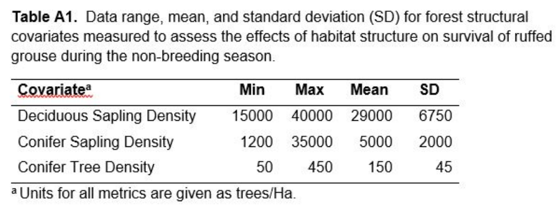

```{r setup, echo=FALSE, warning=FALSE}
knitr::opts_chunk$set(echo = TRUE)
```

```{r, include=FALSE}
options(tinytex.verbose = TRUE)
```

```{r, echo=FALSE, warning=FALSE}
library(knitr)
opts_chunk$set(tidy.opts=list(width.cutoff=50),tidy=TRUE)
```

```{css, echo=FALSE}
.scroll-200 {
  max-height: 200px;
  max-width: 100%;
  overflow-x: auto
  overflow-y: auto;
  background-color: inherit;
}
```

```{r echo=FALSE, include=FALSE, warning=FALSE}
#install.packages("RMark")
library(RMark)
#install.packages("bookdown")
library(bookdown)
library(ggplot2)
#install.packages("curl")
library(curl)
#install.packages("kableExtra")
library(kableExtra)
#install.packages("formatR")
```


```{r echo=FALSE, include=FALSE, warning=FALSE}

## runs relevant lab 6 code

rm(list=ls())

cleanup(ask=FALSE)

RUGR.ch<- read.csv("RUGRData.csv", 
                   colClasses=c('numeric', 'character', 'factor', 'factor', 'factor',  'numeric', 'numeric', 'numeric')) 

RUGR.process<- process.data(RUGR.ch, 
                              model="Known", 
                              nocc=8, 
                              groups=c("Study.Area", "AgeClass", "Sex")) 

RUGR.ddl<- make.design.data(RUGR.process) 


S.Study.Area<- mark(data=RUGR.process, 
                ddl= RUGR.ddl,  
                model.parameters=list(S=list(formula=~Study.Area)), 
                brief=TRUE, silent=TRUE) 

S.Month.Sex<- mark(data=RUGR.process, 
                ddl= RUGR.ddl,  
                model.parameters=list(S=list(formula=~time + Sex)), 
                brief=TRUE, silent=TRUE) 

S.Month.Age<- mark(data=RUGR.process, 
                ddl= RUGR.ddl,  
                model.parameters=list(S=list(formula=~time + AgeClass)), 
                brief=TRUE, silent=TRUE) 

S.Month.StudyArea<- mark(data=RUGR.process, 
                ddl= RUGR.ddl,  
                model.parameters=list(S=list(formula=~time + Study.Area)), 
                brief=TRUE, silent=TRUE) 

S.Month<- mark(data=RUGR.process, 
                ddl= RUGR.ddl,  
                model.parameters=list(S=list(formula=~time)), 
                brief=TRUE, silent=TRUE) 


S.Sex<- mark(data=RUGR.process, 
                ddl= RUGR.ddl,  
                model.parameters=list(S=list(formula=~Sex)), 
                brief=TRUE, silent=TRUE)

S.Age<- mark(data=RUGR.process, 
                ddl= RUGR.ddl,  
                model.parameters=list(S=list(formula=~AgeClass)), 
                brief=TRUE, silent=TRUE) 

S.Study.Area<- mark(data=RUGR.process, 
                ddl= RUGR.ddl,  
                model.parameters=list(S=list(formula=~Study.Area)), 
                brief=TRUE, silent=TRUE) 

S.null<- mark(data=RUGR.process, 
                ddl= RUGR.ddl,  
                model.parameters=list(S=list(formula=~1)), 
                brief=TRUE, silent=TRUE) 

```

# Lab Overview

This lab constitutes the second half of the ruffed grouse known fate survival analysis.  In Lab 6 we were introduced to the data and learned how to run different model structures that featured categorical variables (group, month, etc) in a general linear model framework.  In that lab we focused primarily on evaluating differences in survival rates through time (months), among study areas, and between sex and age classes. In this lab we will expand our analysis to evaluate the effects of habitat structure on ruffed grouse survival using what we will call continuous covariates, which is a catch-all term for any values we might measure that can be expressed as a continuum.  Other examples of continuous variables might include the size or body mass of the animal, or environmental conditions like temperature or precipitation experienced by the population through time.

## Learning Objectives

1) Apply principles of continuous predictor variables to a survival analysis, using our GLM framework for constructing models.

2) Learn additional aspects of statistical inferences from GLMs based on interpretation of model $\beta$ coefficients and their 95% confidence intervals.

3) Translate model results into management-relevant interpretations.

# Application of Continuous Covariates to Linear Models

In some ways modeling the effect of a continuous predictor on survival should be relatively intuitive, because it will mesh a bit more with the foundational concepts of linear regression you've been exposed to in the past.  Let's consider a hypothetical scenario where the annual survival of an organism, say, a wood frog, is affected by rates of annual precipitation.  The hypothesis here might be that during wet years, there are longer hydroperiods in the temporary wetlands during the breeding season, and greater amounts of soil moisture in the surrounding uplands during the non-breeding period. 

We can conceptualize this model using the same glm form as for Lab 6, 

\begin{equation}
\label{eq:1}
logit(S)=\beta_{0}+\beta_{1}*x_{1}
\end{equation}

where $\beta_{0}$ still reflects the model intercept, or the predicted value of S (logit-transformed) when x=0, and $\beta_{1}$ is now the slope of the precipitation effect, or how much we expect S to change as a function of an increase in precipitation.  Notice that **_equation \textcolor{red}{\ref{eq:1}}_** uses the notation logit(S) to reflect the fact that this equation would be applied under the logit link function to constrain the output to fall between 0 and 1 on the probability scale.  If we were to graph this relationship, in a situation where $\beta_{0}$ had a value of -1.45 and $\beta_{1}$ had a value of -0.06, it might look something like:


```{r echo=FALSE, include=TRUE}

x.seq<- seq(0,50,1)
beta.0<- -1.45
beta.1<- 0.06

y.seq<- plogis(beta.0+beta.1*x.seq)

xy.df<- data.frame(x=x.seq, y=y.seq)

xy.plot<- ggplot(xy.df, aes(x=x, y=y))+
  geom_line(size=1.5)+
  ylim(0,1)+
  xlim(0,50)+
  ylab("Probability of Survival")+
  xlab("Annual precip (inches)")+
  theme_classic()
  
xy.plot


```
which shows the clear positive association between precipitation and survival.  Also note here that the line shows a slight bend on either end - this is because of the constrains imposed by the logit-link function.  As we get closer to 0 or 1 (the upper and lower bounds, respectively) the line flattens and the response curve levels. 

These functional relationships can be really very informative, because they allow us to predict a particular survival probability for a given value of the covariate.  For example, if we measured annual precipitation for a given year of, say, 23.4 inches, we could apply this as an X value in **_equation \textcolor{red}{\ref{eq:1}}_**, using the $\beta$ values I show above, as 

\begin{equation}
\label{eq:2}
logit(S)=-1.45+0.06*23.4
\end{equation}

which would return a value of S=0.4885, telling us to expect about 49% of frogs to survive the year.  As we will see in the lab today, when we extend these principles to characteristics of habitat, they offer a really valuable tool for evaluating habitat quality and guiding management.  To extend our wood frog example, imagine if we also measured the canopy cover in the forests surrounding the vernal pools in which the frogs were breeding, and established another positive relationship between canopy cover and adult wood frog survival.  We could then use this relationship to say that for a target % of canopy cover, we expect a resulting probability of survival, and use those values to support forest management guidelines to promote suitable habitat.  These are exactly the kinds of questions we'll approach in today's lab.

# Extending Continuous Covariates to the Ruffed Grouse Example

This lab will pick up where last week's left off, using the same data on ruffed grouse survival.  As a quick refresher, what we have here is data from radio-marked ruffed grouse that were monitored over an 8-month period from September through April in 3 study areas.  At the end of last week's lab, you should have found that the best-supported model, based on AIC, was the S(Month) model (or S(time) based on the RMark syntax), with a few other models falling within 2.0 $\Delta$AIC of the top model.

For this week's lab, we will use our best-supported model from Lab 6, and move forward testing the effects of 3 habitat variables that were included in the dataset, but that we did not evaluate last week.  You can imagine that these are forest metrics that were measured at locations where our radio-marked ruffed grouse were found, and the covariates represent the mean of all the values recorded for each individual grouse. These variables are the density of deciduous saplings (DS), the density of conifer saplings (CS), and the density of conifer trees (CT).

## Running continuous covariate models

Before we get started, we will want to select one of our models from Lab 6 as a 'base' structure that we will add our continuous covariates to. To complete this lab, you should first have all of the models from Lab 6 run and present as objects in your workspace.  To check this, use the collect.models() command to re-generate your AIC table from Lab 6.  

```{r eval=FALSE, echo=TRUE, results = 'hide', warning=FALSE }

RUGR.AIC<- collect.models(type='Known')

RUGR.AIC

```

If you find your models are missing, you'll need to start by re-running your Lab 6 code. Although this might seem daunting, if your code was clean from the last lab it should re-run without issue in a matter of minutes.

Once you've gotten collect.models() to return the same AIC table as your Lab 6 assignment, you should find that S(Month) is the best-supported model (your model object is probably labeled S.Month), but with S(Month+Age) and S(Month+Sex) Also supported based on our criteria of 2.0 $\Delta$AICc.  So, which of these three supported models do we move forward with?  Given our use of a GLM framework for conducting this analysis, we can introduce a new form of inference based on the $\beta$ coefficients in our model.

During Lab 6 we covered how to export the $\beta$ coefficients, and you used the estimates themselves to reconstruct the logit link equation and derive survival estimates.  But there are more to these results than we dug into.  Let's pull up the $\beta$ results for the S(Month+Age) model, which you should find fell within 0.67 $\Delta$AICc of the top model

```{r eval=TRUE, echo=TRUE, warning=FALSE }

S.Month.Age$results$real

```

The column labeled 'estimates' gives us our $\beta$ coefficients, which we used last week, and just to reorient yourself you should recognize which parameter in the model each of these correspond with.  For example, the first value, 2.9041994, is the model intercept term.  It also is the $\beta$ that, on its own, defines the effect of survival during time interval 1, or the month of September.  Each of the next 7 $\beta$ coefficients give us the effects of the other 7 time intervals, starting with October ($\beta$=-0.8939271), November ($\beta$=-0.1437519), and soforth.  When one of these monthly $\beta$ estimates has a negative value, it indicates that survival was lower during that month relative to the intercept (September), and a positive value indicates the monthly survival probability was greater than during September.

In the very last row, the $\beta$ labeled 'S:AgeClassJuvenile' gives us the effect of age in the model, and as the label implies it specifically tells us the effect of being a juvenile, or young grouse.  The estimate of the $\beta$ in turn tells us the degree to which juvenile survival is expected to differ from adult survival, and its negative value ($\beta$=-0.1897924) indicates that young birds have lower survival than adults.

In the next 3 columns to the left, we are given the standard error (se) of each estimate, along with the lower (lcl) and upper (ucl) limits of the 95% confidence intervals.  Recall that in a regression, we are implicitly testing a hypothesis that the slope of a relationship is different from 0.0.  The 95% CIs of a regression coefficient (i.e. $\beta$) provide an assessment of whether the slope is statistically different from zero, because we can ask whether they suggest that the true underlying slope might contain zero.  This is entirely analogous to interpreting a p-value with an $\alpha$ level of 0.05.  So, in the case of the Age Class variable in this model, despite the fact that $\beta$=-0.1897924, we see that the upper limit of the 95% CI is well-above zero at ucl=0.1305.  Therefore despite the support with AIC, we can conclude that there is not meaningful statistical support for a true difference in survival between the two age classes. 

So, moving forward you should use a 2-stage approach to inference.  First, use model selection and $\Delta$AICc to evaluate whether a particular *model* is supported, and then use the upper and lower confidence limits to determine whether any particular *variable* within the model is supported. Based on these criteria, you should look through any supported models from lab 6 (those within 2.0 $\Delta$AICc) and determine whether the age and/or sex covariates should be carried forward into models assessing habitat characteristics.  

> **_Sidebar - Beta coefficients and time effects - _** There is one caviat to the rule of interpreting the beta coefficients and the CIs, which has to do with categorical effects in situations where there is >2 groupings.  A good example of this is for the effect of Month (time) in our ruffed grouse survival analysis. Here, the intercept beta is associated with the effect of our first month, September, and each of the other monthly betas (estimates 2 through 7) tell us how much, on the logit scale, that particular month is expected to deviate from September, which is the reference month. So here, a negative value doesn't represent a negative effect per se, but rather a survival that is lower than survival in September.  In this case, the 95% CIs do not reflect whether an effect is statistically significant, or not, but rather whether it can be considered meaningfully different from the reference month as represented by the intercept term.  So, the take home here is that our rules above for using 95% CIs to infer variable support apply to either continuous covariates, or to categorical variables with only 2 levels (such as age or sex, in this case).  Once we get to the point of having >2 categories, the interpretation becomes far more nuanced.  In that case, I recommend relying on AICc for model comparison, and exploring the real parameter estimates (survival probabilities) to understand the differences among levels of your categories.

## Testing habitat variable effects

With the above assessment in mind, I'd like you to run 3 additional models that evaluate the effects of deciduous saplings, conifer saplings, and conifer trees on ruffed grouse survival.  For these models, you should include the base structure along with each of the individual covariates.  Under this approach, you'll include any extra sources of variability, such as the effects of month, sex or age, and control for them while testing for the effects of the linear habitat variables.

Here is an example for the deciduous sapling variable, where the only difference in this code from the S.Month model from the last lab is that we've added + DS to the formula= statement, to apply the covariate DS to the model.  

```{r eval=TRUE, echo=TRUE, results = 'hide', warning=FALSE }

S.Month.Decid<- mark(data=RUGR.process, 
                ddl= RUGR.ddl,  
                model.parameters=list(S=list(formula=~time + DS)), 
                brief=TRUE, silent=TRUE) 

```

Using the code above as a starting point, run two additional models that test for effects of conifer trees and conifer saplings on survival.  In running these models, we are testing 3 alternative hypotheses about habitat effects on ruffed grouse survival. 

1) availability of dense deciduous stems is most important because it allows grouse to successfully evade predators.

2) the presence of conifer trees has a negative effect on grouse survival by providing concealment to aerial predators.

3) having conifer saplings in the mid story is most important to provide thermal cover during winter.


Once you've run these models (yep, there are only 3) your task will be to use the AIC scores, $\beta$ estimates and their CIs, and the real parameter estimates to complete this week's assignment.  You should use the approaches we covered in Labs 5 and 6 to aid you in extracting the real estimates, beta estimates, and AIC tables from your analysis.  Before we get to the assignment though, there is one more quirk I want to walk you through that will help with your final interpretations.

```{r eval=TRUE, echo=FALSE, results = 'hide', warning=FALSE }

S.Month.ConifS<- mark(data=RUGR.process, 
                ddl= RUGR.ddl,  
                model.parameters=list(S=list(formula=~time + CS)), 
                brief=TRUE, silent=TRUE) 


S.Month.ConifT<- mark(data=RUGR.process, 
                ddl= RUGR.ddl,  
                model.parameters=list(S=list(formula=~time + CT)), 
                brief=TRUE, silent=TRUE) 


```

## Covariate standardization under a 'z' transformation

The beauty of using covariates in a survival analysis is that they allow us to test for relationships between continuous explanatory variables and survival.  This means we can not only evaluate the importance of biologically meaningful sources of variation, but we can also represent the consequences of that variation across a continuous range of possible values.  This provides a lot of power in assessing the relative importance of any given effect; a covariate with a “significant” effect, but that produces a relatively small response in survival probability across the range of values you observe in the wild, may not be that biologically important.  Consider the following two survival curves:


```{r echo=FALSE, include=TRUE}

x.seq<- seq(0,10,1)
beta.0<- 1.45
beta.1<- -0.13

alpha.0<- 1.62
alpha.1<- -0.26

y.seq<- plogis(beta.0+beta.1*x.seq)
z.seq<- plogis(alpha.0+alpha.1*x.seq)


xy.df<- data.frame(x=x.seq, y=y.seq, z=z.seq)

xy.plot<- ggplot(xy.df, aes(x=x, y=y))+
  geom_line(size=1.5)+
  geom_line(data=xy.df, aes(x=x, y=z), color='red', size=1.5)+
  ylim(0,1)+
  xlim(0,10)+
  ylab("Probability of Survival")+
  xlab("Covariate Value (x)")+
  theme_classic()
  
xy.plot


```
Both represent negative effects on survival that (depending on the strength of the dataset) may be supported as “significant” effects (i.e. we can conclude their slopes does not equal 0.0).  However, across the range of observed values (1-10 in this case) covariate 1 (the red line) produces a much stronger effect on survival than that of covariate 2 (the black line).  Therefore, the relative importance of covariate 1 in determining the survival rates of our study organisms is also much greater.  From a management perspective, for example, we might conclude then that we should place higher importance on addressing issues related to covariate 1, and can be less aggressive with respect to our treatment of covariate 2.  

As we've learned, the $\beta$ coefficients for our covariate terms describe the slopes of the relationship between a covariate and survival.  The sign of $\beta$ tells us whether the effect is positive or negative, the absolute value of $\beta$ tells us what the magnitude of the effect is, and the confidence intervals of $\beta$ give us a diagnostic as to whether the effect is “significant” (slope different than 0.0).  Based on all of this, we can also compare the absolute values of the $\beta$ of two variables to assess which has a greater effect size; in the case above, the black line was produced from $\beta$= -0.13, while the red line was from $\beta$= -0.26.

But, this relative comparison only works if two covariates are measured on the same scale.  Recall that each $\beta$ coefficient reflects the slope of the covariate relationship, or how much we expect survival to change (on the logit scale) given a 1-unit change in an x-variable. If the units differ among variables, the slopes then, by definition, are not directly comparable.  One common method that is used to address this, in a survival analysis or otherwise, is to z-standardize the covariate values prior to analysis.  Performing a z-transformation is relatively straight-forward:

\begin{equation}
  \label{eq:3}
  Z=\frac{x-\overline{x}}{SD}
\end{equation}

Where the z-standardized score for each observation (x) is calculated based on the mean covariate value for the sample ($\overline{x}$) and the sample standard deviation (SD).  

Notice that this transformation is uniform across all levels of x.  It differs from other forms of standardization you may be familiar with (e.g. log transformation) in that it does not change the distribution of the data at all.  What it does is to normalize the distribution such that the sample mean = 0.0 and the sample SD = 1.0.  When considering multiple covariates in a single analysis, whose raw values may be measured in different units, the z-standardized scores will place the covariates on a common scale - that of standard deviation - making the $\beta$ coefficients directly comparable among all covariates in your analysis.  A covariate with $\beta$=0.6 has twice the magnitude of effect as a covariate with $\beta$=0.3, regardless of what units the raw values of each are measured in.  This offers some utility in “eye-balling” $\beta$ values among multiple covariates to assess the strength of effects; a larger absolute value for beta means a larger effect.  Without the standardization we cannot make this assessment.   

Also, and from a more pragmatic perspective, the $\beta$ values will now be, in general, more practical to work with, because most of your covariate values will fall somewhere between -3 and +3.  Imagine a scenario where you derive covariate values that span a very large range of values, say between 100 and 10,000, and they produce a “significant” effect on survival.  Because survival probability is bounded by 0.0 and 1.0 (given the logit link), the resulting value for $\beta$ may need to be exceptionally small (e.g., $\beta$=0.000005) to fit the true effect of the covariate on survival.  It turns out that this can challenge the numerical optimization procedures when trying to maximize the likelihood, but with a Z-transformation the $\beta$ do not behave so mischievously.  For these reasons, a z-standardization is often useful.  

In theory, if you are working with covariate values that span a reasonable range, and you are not interested in comparing among competing covariates, there’s no real reason to z-standardize.  However, it was recommended to me that performing this transformation on covariate values is a very good practice to get into, and that we should always do it on principle, and that’s my recommendation to you as well.  This is true of demographic analysis, and regression-based modeling in general. Performing a z-standardization should have no effect on the final interpretation of your analysis – the same models should perform equally well (in fact, AICc should not change) and the “significance” of covariate effects should be the same with or without standardization.  

For the purpose of this class, you should recognize that z-standardization exists and is a technique commonly used in demographic modeling.  Also recognize that I have standardized the covariates you are using in the analysis, and that the beta coefficients from the model results reflect the standardized covariate values, which is useful to know for the interpretation of your model results.  

## Back-transforming the z-score

To complete today's assignment, I've asked that you make a figure showing the effects of one of your supported covariates, similar to the ones I've provided in this lab handout.  This will be most meaningful if we can create that figure with the actual units of the covariates on the x-axis, which would allow the interpretation, for example, by a manager looking to achieve a particular survival target. 

First, you should export the beta estimates from your best-supported RMark model, which presumably contains one of our three covariates, into Excel.  Here is a refresher of steps outlined in the Appendix of lab 6 if you need a reminder of how to accomplish this - remember, you will need to change the Model_Name and the file path below.

```{r eval= FALSE, echo=TRUE, warning=FALSE}

# Return and view the beta parameter estimates of a model object

Model_Name$results$beta  

# create dataframe of estimates

Beta.Estimates<- data.frame(Model_Name$results$beta)

# write betas to csv

write.csv(Beta.Estimates, file= "C:/Your Path/RealEstimates.csv")


```

Open your csv file in Excel.  In column F, create a sequence of values from -2 to 3.  This is most easily accomplished by typing out the first few values in the sequence (e.g. -2, -1.8), highlighting them, and then dragging them downward until you hit the end point (3).  This will create a systematic range of numbers (i.e., a sequence).  It doesn't particularly matter how many numbers you create here, and they do not need to be the same length as the values in the beta estimate table.  What you have just created is a range of a hypothetical series of z-transformed covariate values.  

** Note ** - We need to start at -2 because it turns out that with discrete counts, like # of trees, we shouldn't be producing back-transformed estimates that are negative.  For the data we are actually using in this lab, a lower value of Z=-2 should come out fairly close to a back-transformed estimate of 0.   

Now, in column G, right next to your new series of z-scores, we will reconstruct the logit link equation to derive our survival probabilities based on the model $\beta$ coefficients. This will be the same process you used as part of lab 6, but here instead of 1 estimate for each study area (the Lab 6 example) we will calculate 1 probability for each value of the covariate.  Starting in the first cell of column G, write a formula for the following equation:


\begin{equation}
\label{eq:4}
  S=\frac{\exp(\beta_{0}+\beta_{Cov}*Z_{i})}{1+\exp(\beta_{0}+\beta_{Cov}*Z_{i})}
\end{equation}

where $\beta_{0}$ is the model intercept term, $\beta_{Cov}$ is your covariate $\beta$, which is the estimate labeled S:CT in the beta table.  The $Z_{i}$ in the equation above is your first Z-scaled value in column F.  If you think carefully about your anchoring, you should be able to drag this value downward to produce a unique survival probability for each covariate value, where $Z_{i}$ becomes a new value as you drag the formula down.  You have just created a series of values that can be used to generate a figure like those shown above, and if you did it correctly you should find they are all plausible probabilities that trend systematically in one direction or another. 

** Note ** - we didn't use any of the time variables in this calculation, so we are effectively assuming the covariate effect applied only to the month of September, which we've already said is defined by the model intercept.  If we wanted to use a different month as our baseline we could include that as an additional parameter in the estimate, but for our purposes September only is just fine.  The implications of this are you can skip using the second through seventh $\beta$ estimates in generating your estimates.  Of course, we aren't *REALLY* skipping them, we are just assuming they are all multiplied by zero, canceling their effects such that they don't need to be included in the formula.

Alright, as a last step, we need to back-transform those Z-values in column F to get them into the actual range of the field values we collected.  In column H, perform this back-transformation in each cell using the following equation:

\begin{equation}
\label{eq:5}
  X=Z*SD+\overline{x}
\end{equation}

which is just an algebraic rearrangement of the Z-scale equation above.  You will need to use the mean and SD values for your covariate provided in the table below, and if you do this correctly you should have a range of values in column H that are in the same ballpark as the values given in the table for that covariate.  When you create your figure, use these values in column H as your x-variable range, and the probability values in column G as your y-range, and you'll have a nice response curve showing how survival changes as a function of the actual measured habitat characteristics. 




# The Three Big Things You Should Have Learned Today

1) How to interpret $\beta$ coefficients, including their 95% confidence intervals, to improve inference in a survival analysis.

2) What a z-transformation does and why it is useful.

3) How to project survival probabilites as a function of a continuous predictor variable.

# Lab 7 Assignment

Your assignment for this lab will be to compile the results of the survival analyses from Lab 6 and Lab 7 into a RESULTS section as it would appear in a published manuscript.  We will be looking for you to integrate the results from these two labs as though they are components of a single analysis (because they are), so you should compose a single seamless RESULTS section and not one that is lab-specific. You can look to recently published papers as sources of inspiration, as well as the following general guidelines:

*Results*: The RESULTS section should report on the important findings of the study without delving into interpretation of those results (interpretation is saved for the DISCUSSION).  It is often useful to start with a paragraph that describes the summary results of the study (how many birds were caught in each study area, what was the age and sex breakdown, how many died, etc).  In the case of this assignment you should be able to glean this descriptive information from the input data that you used to create the RMark analysis.  You should then follow this first paragraph with one or more paragraphs that describe the actual results of your analyses.  What was the most competitive model structure, and what were the statistical results that allowed you to determine this?  If temporal effects were supported, how did survival vary among time intervals?  Which covariates were supported, which did not receive support, and what statistical results allowed you to make these inferences?  Importantly, what was the actual effect of the covariates on the survival of the organism? What do we predict as the overall survival probability for ruffed grouse during the non-breeding season? You should always strive to back up declarative statements in the results with supporting information, either by referencing the table or figure that demonstrates the result you are describing, or by including supporting statistics or parameter estimates directly in text.  For example:

*We found that survival of tribbles was dynamic among years; a model that contained a year effect was 3.5 $\Delta$AICc better-supported than the null model (Table 1). Tribble survival was greater during year 1 (S=0.57 +/- 0.03 SE) compared with year 2 (S=0.49 +/- 0.04 SE).  We found that a major trouble with tribble survival was that individuals exposed to lower temperatures had decreased survival ($\beta$=0.65; 95% CI = 0.12 to 0.89) relative to those exposed to higher temperatures.  We also found that tribbles inhabiting study area 1 had the highest survival rate, those inhabiting study area 2 had intermediate survival, and the lowest survival rates were attributed to tribbles in study area 3 (Fig. 1).*

In the preceding example, Table 1 would consist on an AIC table that showed my model selection results, and Figure 1 would be a graph depicting the differences in survival between the three study areas (with SEs or CIs, of course).   

In general, your RESULTS section should be as descriptive and inclusive as possible.  The reader should be able to clearly interpret your findings, to understand which statistical results of your analysis lead you to make the interpretations you have, and ultimately be left with a clear picture of the important biological outputs of your analysis.

*Tables/Figures*: Please produce at least one table and one figure to accompany your results section.  For your figure, I would like you to present the effect of one of the covariates that we tested in lab this week. Conventions for table and figures should follow those that we’ve used throughout the semester.  Please insert your figures directly in the word document, embedded as .jpg files using the “paste special” option in Word.  Your table should be pasted directly into your Word document as text that may be edited. In practice you can do this by copying the table in  Excel and pasting (CTRL+V) it directly into Word. As a tip, sometimes it is easier to edit the formatting of tables in Word than in Excel.

You should submit your completed Results/Table/Figure assignment as a single Word document on Brightspace prior to the start of the next lab. Please also upload your completed R script, as usual.

