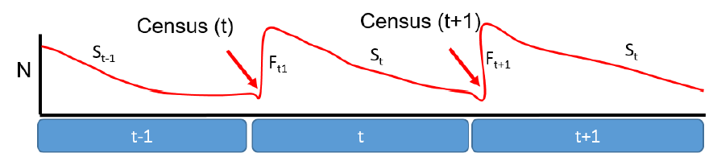
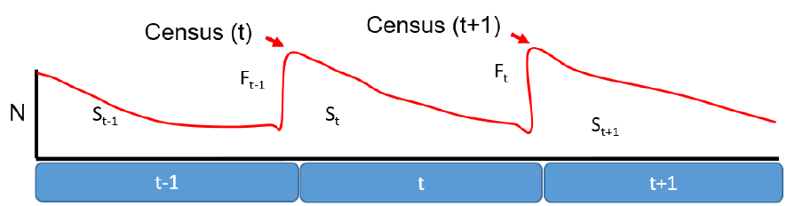
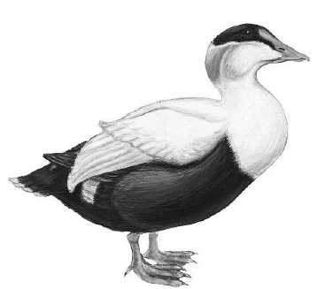
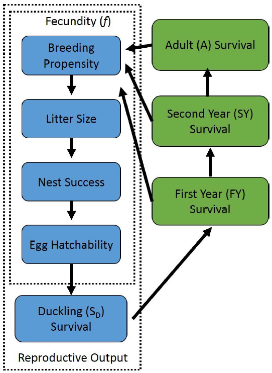
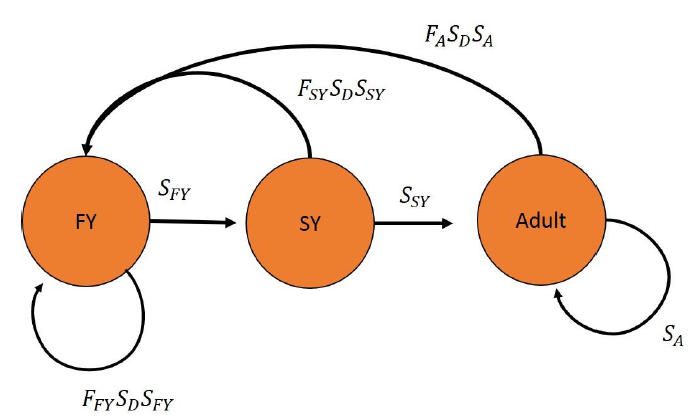

```{r setup, echo=FALSE, warning=FALSE}
knitr::opts_chunk$set(echo = TRUE)
```

```{r, include=FALSE}
options(tinytex.verbose = TRUE)
```

```{r, echo=FALSE, warning=FALSE}
library(knitr)
opts_chunk$set(tidy.opts=list(width.cutoff=50),tidy=TRUE)
```

```{css, echo=FALSE}
.scroll-200 {
  max-height: 200px;
  max-width: 100%;
  overflow-x: auto
  overflow-y: auto;
  background-color: inherit;
}
```

```{r echo=FALSE, include=FALSE, warning=FALSE}
#install.packages("RMark")
library(RMark)
#install.packages("bookdown")
library(bookdown)
library(ggplot2)
#install.packages("curl")
library(curl)
#install.packages("kableExtra")
library(kableExtra)
#install.packages("formatR")
```

In this lab we’ll be using the principles of age-structured population modelling to project the trajectory of breeding Common Eider (*Somateria mollissima*) populations in the Gulf of Maine. You’ll be working with actual population vital rate estimates from common eider research conducted by Brad Allen and others from the Maine Department of Inland Fisheries and Wildlife, and you will use a combination of population projections, sensitivity analysis, and parameter perturbations to answer questions related to eider management. This sort of exercise would be the logical last step after collecting mark-recapture data and estimating population vital rates; it provides the synthesis tool to ask questions about how those vital rates, and the factors that affect them, are likely to influence populations of your species of interest.

These methods fall under a suite of modelling techniques based on population projection matrices, and they are often referred to as population viability analysis (PVA). However, PVA really is more appropriately thought of as a particular application of matrix-based population modelling in which a formal assessment of extinction probability is a major goal of the analysis. We’ve covered the bulk of the background materials for this week in lecture, and you can see the lectures slides and/or notes, in addition to the materials below, as you complete the lab.

# A quick primer on age- and stage-based projection matrices

Most of the “classic” theoretical models of population growth, such as the logistic or the exponential models, assume no age structure in population demographics; all individuals possess the same survival probability and reproductive output, such that the growth of the population (which is of course defined by per-capita recruitment and survival) is not sensitive to the age distribution. In other words, it doesn’t matter if there are more young individuals relative to older individuals because individuals of all ages are assumed to be demographically identical. Of course this is rarely the case, and so we need a method to extend the principles of population growth models to cases where there is age-structure in the population. Age- or stage-based projection matrices, often referred to as Leslie and Leftkovitch matrices, respectively, provide us with that tool. In short, these methods break down the simple linear equation provided by the classic growth models (e.g. the exponential) into a form that allows for projection of multiple age classes, and for individuals to transition among age classes, as the population grows. This is done using principles of matrix algebra. For example, you should recall that the basic model for projecting continuous exponential population growth in year $t$ based on a starting abundance at time 0 is given as:

\begin{equation}
  \label{eq:1}
  N_{t}=N_{0}e^{rt}
\end{equation}

Where *r* is the instantaneous growth rate, defined by the underlying birth and death rates of the population. This model can be extended to a discrete form:

\begin{equation}
  \label{eq:2}
  N_{t+1}=N_{t}\lambda
\end{equation}

Which allows us to project abundance in year $t+1$ as a function of abundance in year t, based on the geometric population growth rate ($\lambda$). Here, lambda relates directly to the instantaneous growth rate, $r$, as:

\begin{equation}
  \label{eq:3}
  \lambda = e^{r}
\end{equation}

Or alternatively:

\begin{equation}
  \label{eq:4}
  r = ln(\lambda)
\end{equation}

Importantly, as with $r$, $\lambda$ is ultimately defined by underlying birth and death rates, which we’ll approximate using survival probability ($S$) and per-capita recruitment ($R$):

\begin{equation}
  \label{eq:5}
  \lambda = S + R
\end{equation}

And the growth equation from above can similarly be expressed in terms of $S$ and $R$ as:

\begin{equation}
  \label{eq:6}
  N_{t+1} = N_{t}S + N_{t}R
\end{equation}

where we assume population closure, such that immigration/emigration do not influence the change in abundance year to year.

Now that we’ve got the basics out of the way, we can extend these principles to an age-structured population by recognizing that $N_{t}$ and $N_{t+1}$ are the summation of the abundances for each underlying age class in the population. For example, if we have three age classes then we can approximate $N_{t}$ as:

\begin{equation}
  \label{eq:7}
  N_{t} = N_{t(age1)} + N_{t(age2)} + N_{t(age3)}
\end{equation}

which should be completely intuitive. With a little bit of effort, we could re-write **_equation \ref{eq:6}_** to reflect a three-age linear model, with $N_{t}$, $S$, and $R$ for each individual age class combining to predict the total abundance of the population in year $t+1$. However, that’s a bit clunky and will get tougher if we add additional age classes, plus we ultimately want to be able to project abundance out for multiple time steps, which is going to be difficult if we have to replicate a single linear equation for each time step. Luckily, we can formalize the equation in matrix format quite simply as:

$$\begin{bmatrix}R_{1} & R_{2} & R_{3}\\
S_{1} & 0 & 0\\
0 & S_{2} & S_{3}
\end{bmatrix}*
\begin{bmatrix}N_{t(1)}\\
N_{t(2)}\\
N_{t(3)}
\end{bmatrix}=
\begin{bmatrix}N_{t+1(1)}\\
N_{t+1(2)}\\
N_{t+1(3)}
\end{bmatrix}$$

where the 3x3 matrix provides age-specific recruitment and survival terms for each age class, the first vector reflects the abundance of each age class in time $t$, and the product of the matrix and the vector yields the abundances of each age class in $t+1$. You’ll need to recall the basics of matrix algebra to solve this operation, and if you need a refresher you might check out the following:

[http://ibgwww.colorado.edu/~carey/p7291dir/handouts/matrix.algebra.pdf](http://ibgwww.colorado.edu/~carey/p7291dir/handouts/matrix.algebra.pdf)

Ultimately, the solution to the above formula (i.e. the right most vector that yields $N_{t+1}$ for each age class) is given as:

$$\begin{bmatrix}R_{1}N_{t(1)} + R_{2}N_{t(2)} + R_{3}N_{t(3)}\\
S_{1}N_{t(1)} + 0*N_{t(2)} + 0*N_{t(3)}\\
0*N_{t(1)} + S_{2}N_{t(2)} + S_{3}N_{t(3)}
\end{bmatrix}$$

Which is really just a stacked version of the linear equation we’d need to replicate **_equation \ref{eq:6}_** for each age class, and if each of the three rows above are solved we are left with the vector of abundances for each age class in the next time step. The 3x3 matrix above tells us some very important things about the demographics of this population:

$$\begin{bmatrix}R_{1} & R_{2} & R_{3}\\
S_{1} & 0 & 0\\
0 & S_{2} & S_{3}
\end{bmatrix}$$

This 3 x 3 projection matrix tells us that our organism has 3 distinct age classes, each of which are reproductive. The top row in a projection matrix will always represent the stage-specific fecundities, or the per-capita production of offspring, whereas the lower elements give stage-specific survivals. Zeros occur in locations where impossible transitions occur; e.g. a stage-1 individual cannot survive and transition to stage-3 (if this were possible, the lower left cell would contain that probability value). This example matrix assumes that all age classes are reproductive, however that will not always be the case. For example, in the following matrix, only stage 2 and 3 individuals are reproductive.

$$\begin{bmatrix}0 & R_{2} & R_{3}\\
S_{1} & 0 & 0\\
0 & S_{2} & S_{3}
\end{bmatrix}$$

There are some more fine details, such as whether the projection is set up using a pre- or a post-breeding census, which make different assumptions about when the population is counted, i.e., the time of year that abundance is relative to. This has implications for how we include the recruitment terms in the model. Under a pre-breeding census, the count occurs just prior to the annual birth pulse:



So, for animals that are born (the fecundity terms, $F$) to officially enter the population, they have to survive from birth to their first census just prior to the following year’s birth-pulse. We incorporate this in the upper row of the matrix by including an $S_{0}$ term, which gives the annual survival probability of ‘age 0’ animals that have not yet reached their first census. In this case, $R$ is a product of the age-class-specific fecundities ($F$) and $S_{0}$.

$$\begin{bmatrix}F_{1}S_{0} & F_{2}S_{0} & F_{3}S_{0}\\
S_{1} & 0 & 0\\
0 & S_{2} & S_{3}
\end{bmatrix}$$

The matrix above would be reflective of a pre-breeding census, whereas a post-breeding census model for the same species would look different. Under the post-breeding census, we don’t conduct the census until after the annual birth pulse has occurred:



$$\begin{bmatrix}0 & F_{1}S_{0} & F_{2}S_{0} & F_{3}S_{0}\\
S_{0} & 0 & 0 & 0\\
0 & S_{1} & 0 & 0\\
0 & 0 & S_{2} & S_{3}
\end{bmatrix}$$

Also, you will notice that we’ve added a dimension to the matrix; it is now 4x4 whereas the companion pre-breeding census matrix was 3x3. This is because the ‘age 0’ animals are now counted just after being born, but still need to survive their first year, which we accommodate with an additional age class.

So, the big differences between a pre- and a post-breeding census are that in the post-breeding census the upper elements of the matrix include the product of the fecundity terms and the stage-specific annual survivals, while under a pre-breeding census they are the product of the fecundities for each age/stage and a first year survival ($S_{0}$). And necessarily a post-breeding census will typically have an extra dimension compared with a pre-breeding census for the exact same organism.

## Other matrix properties
In addition to simply projecting population growth, stage-based matrices also have some mathematical properties, based on principles of calculus, which we can use to make interpretations about the population. These include:

- **Dominant eigenvalue**: the dominant eigenvalue of the matrix represents the deterministic population growth rate, $\lambda$.

- **Sensitivity analysis**: vital rate sensitivity is defined as the absolute change in $\lambda$ that results from a tiny absolute change in a given vital rate. When a vital rate produces a relatively large change in $\lambda$, $\lambda$ is said to be sensitive to that vital rate. In a sensitivity analysis, vital rates with a larger value indicate those to which $\lambda$ is most sensitive, and presumably these are the values that if changed will produce the largest change in $\lambda$.

- **Elasticity analysis**: similar to sensitivity analysis, but refers to proportional changes in each vital rate rather than absolute changes. This is useful in cases where different terms of the matrix (e.g. survival and fecundities) vary dramatically in their units of measure. As with sensitivity values, vital rates with high elasticities are those that we expect to have a disproportionally large effect on $\lambda$. We can also add elasticities together to evaluate the joint elasticity of multiple vital rates (e.g. the elasticity values for survival terms for all breeding-aged age classes).

- **Stable (st)age distribution**: the proportion of individuals in each age or stage class once deterministic $\lambda$ has been reached. Usually the stable age distribution is reached in the first 2-4 years of a projection. Deterministic $\lambda$ (i.e. the dominant eigenvalue of the matrix) assumes a stable age distribution.

- **Reproductive value**: these are stage-specific metrics that predict the future reproductive potential of each age class. Stages with either high survival and/or high fecundity tend to have greater reproductive value. This metric also has relevance from an evolutionary perspective.

## Some background on eiders in the Gulf of Maine

Common Eiders are the largest ducks in the Northern Hemisphere, and are part of the waterfowl tribe Mergini, commonly known as the sea ducks. Common Eiders are circumpolar in their distribution; they typically breed in northern latitudes in coastal areas, and reach their highest breeding densities in areas of coastal arctic tundra. The Gulf of Maine represents one of the southernmost breeding populations of Common Eider in the world, and eiders breeding in the Gulf of Maine typically nest on the hundreds of near-shore islands located throughout coastal Maine. Winter range for Common Eiders extends throughout coastal New England and as far south as Long Island, New York. Recently eider populations in the Gulf of Maine have declined, and field research conducted around eider nesting colonies suggests that predation on eider ducklings, particularly by greater black-backed gulls (*Larus marinus*), may result in nearly complete reproductive failure in many colonies most years. For more information on Maine common eiders, see the Common Eider Assessment (Allen 2000) document posted on Brightspace.

## Some logistics before we get started

First you’ll need to open the Excel data file for this analysis from the materials contained on the course website. It is labeled “Maine Eider Population.xls”. You should save it for later use. Note that if you want to work on this lab outside of the Nutting Hall computer labs, you will need to have R and RStudio downloaded and installed on your computer.

# Part 1 – Projecting a population the “hard” way

1. Open your Excel file and navigate to the “Part 1” Tab. In Column A, the relevant population vital rates are listed that you’ll need to fill in the projection matrix. These include stage-specific survival, fecundity, and recruitment rates. Recognize that the fecundities are a product of a number of underlying demographic rates – breeding propensity, clutch size, egg hatchability, sex ratio (50% female at hatch), and nest success. I have already combined these into a single fecundity term, which reflects the number of female ducklings that are produced per female in each age class. The relationship between these parameters and the annual life cycle of eiders in depicted graphically in Appendix 1.

We are only modelling females in this analysis, because males provide no parental care and thus we assume are not a critical driver of the population dynamics. We are conducting this assessment assuming a post-breeding census that occurs just after the annual birth-pulse. For this scenario, we’ll define the “birth-pulse” to include the nesting (the fecundities) and brood-rearing (duckling survival) as components of per-capita reproductive success. So, the cells in the top row of the matrix must contain the product of the survival terms for each age class, the fecundity terms for that age class, and duckling survival (i.e. $S*F*DS$).

2. To the right of the list of vital rates is a 3x3 block of cells highlighted with blue. This is where we will construct the projection matrix for this population. Below these cells is an example matrix that describes the relevant location for each of the population vital rates. Fill in the blue 3x3 matrix by linking the population parameters to the relevant matrix cells. For example, the upper left cell would contain the product of the duckling survival, first year survival, and first year fecundity terms. You should link the matrix cells directly to the corresponding values in the B column. Fill in the matrix cell values accordingly.

3. Now we can project this matrix outward using principles of matrix algebra. In column I you will see a vector of starting abundances ($N_{t}$ for each age class. The total starting population size ($N_{0}$=17,800) approximates (roughly) the number of eiders currently estimated to be in the Gulf of Maine Breeding population. Using the projection matrix and this vector of abundances, we can estimate the number of eiders in each age class by multiplying the matrix by the vector. Use the concepts we covered in lecture, and that are described above, to create formulas that appropriately estimate the abundance of each age class in year 2, given the matrix and the vector of abundances for year 1.

Remember that adding appropriate “$” anchors in each terms of your formula will allow you to drag the formula across columns to project the population outward through time. It will also allow you to drag it downward and fill in the formula for each of the 3 age classes, and then outward to project the population into the future.

4. One you’ve filled in the first year projection for each age class, we can highlight all three cells and drag the formula to the right to fill in the projection for a 15 year period. What you will be left with is the predicted abundance in each of the three age classes for the next 15 years.

5. Now we can calculate a number of relevant population parameters, including the total population size (sum of the abundances in each age class), population growth rate ($\lambda$; $N_{t+1}/N_{t}$), and the proportion of animals in each age class, otherwise known as the age distribution. To get this last value, simply divide the projected abundance of each age class by the total abundance in that time step. Calculate each of these three values for each time step from 1-15, and fill this in the appropriate places in rows 8 through 12.

Notice that the stable age distribution is not reached until several years into the projection. This is because our initial abundances deviated from the stable distribution, and it takes a few years for the distribution of animals in each age class to stabilize. You should notice that after some amount of time, $\lambda$ becomes deterministic, and your calculated age distribution becomes constant.

# Part 2 – Projecting a population the easy way, and conducting a sensitivity analysis, using the PopBio Package and Program R

Now that we’ve seen how to project a stage-based matrix algebraically, we can take advantage of the R package PopBio to do much of the same work for us. PopBio has a number of different and very useful functions, including the ability to estimate $\lambda$ directly based on the Matrix dominant eigenvalue, calculate the stable age distribution, compute age-class reproductive values, and to project the population for a number of time intervals. PopBio will also allow us to conduct sensitivity and elasticity analysis of our projection matrix, which will help us to evaluate the potential contributions of each stage-specific parameter to population growth.

1. First, open RStudio and the R script file ‘EiderPop’ found on Brightspace.

2. Next, we need to recreate our projection matrix from part 1, but as an R object. This will involve a 2-part process of first creating an empty matrix, and then populating it with the correct vital rate values for each element. If you’ve done this correctly, when you as R to return the object ‘A’ it should print a matrix that is identical to the one you’ve already built in Excel.

3. Once we’ve constructed our matrix, we can a basic analysis to estimate the population growth rate. This is done using the eigen.analysis() command. Compare the results with the deterministic $\lambda$ value ($\lambda$ once the stable age distribution was reached) that you calculated in Part 1. It should be identical (which is cool, no?).

4. The eigen analysis also calculated the sensitivity and elasticity values for each element of this matrix. Remember that sensitivity provides an assessment of the predicted absolute contribution of each matrix cell (stage-specific survival or recruitment rate) to the growth of the population. The interpretation is that for rates with high sensitivity, we expect that a small change in the rate will produce a relatively large change in $\lambda$. From a management perspective, this means that we will get the most bang for our buck if we can influence these demographic rates. Elasticity is similar but based on proportional change in each vital rate.

5. Next, we can ask PopBio to produce a population projection for us using the pop.projection() command, which will allow us to estimate the stage-specific and total abundances for each time step, as well as the annual growth rates. Take a look at the resulting projection, and compare it to the results we got from our own matrix algebra exercise in Excel. You should find that the results are identical to your Excel estimates.

# Part 3 – Conducting management simulations

We have now set up a spreadsheet that allows us to reconstruct the (deterministic) future trajectory of this population of birds, and a companion R script that does exactly the same thing. Each component of the spreadsheet is linked, through the formula we’ve used, to the original vital rates listed in columns 1 and 2. In the R script, we can change the values for each of the vital rate objects and re-run the script. In either case, this allows us to change the vital rate values to reflect potential changes in eider demographics that might result if we implemented management actions, such as predator control to increase duckling survival, or increases in survival of HY, SY, and adult birds due to changes in harvest regulations. We can do this in Excel in two ways. I will illustrate how this can be done using two examples, and then will leave it to you to explore the analysis on your own in order to complete the assignment.

1. You can manipulate each vital rate directly, and see how it changes the population growth rate and predicted population size in the future. This is useful if you have a specific level of increase or decrease in a vital rate you thought you could achieve through management. For example, suppose we thought that we could increase adult survival by 0.05 through a change in harvest regulations (as a thought exercise, can you envision a scenario where we might actually be able to do this?). To accomplish this, simply change the value in cell B4 to 0.94 instead of 0.89. When you do this you should find this change causes the population growth rate to increase to ~0.964. An interpretation of this result might be that this management action would reduce the predicted level of decline
for the eider population, but it would not be sufficient to produce stable population growth ($\lambda$=1.0).

2. In some cases, we might be interested in asking how much a certain vital rate would need to change in order to achieve a management goal. For example, to what extent would we need to increase first year survival rates to produce a stable population of eiders? We can do this using the Solver Tool in Excel, which is a very handy tool in general. First, you may need to turn on this Add-in. Click on the File tab on the main menu bar, and select the “Options” button at the bottom of the Menu. When the Options window pops up, click on the “Add-ins” option below, and then click on the “Go” button next to the Manage: Excel Add-ins option at the bottom of the window. This will open up a second window. Make sure the “Solver Add-in” box is checked, and click o.k. If it asks you to install, say yes (may take a minute).

3. Now, under the data tab on the main menu bar, you should see an option for “Solver” right under the “Data Analysis” option (which you have likely used before). Click on this. The window that opens has three important options. One asks to set an objective cell. This is the parameter we want to solve for, in this case our value of $\lambda$ (population growth) once the stable age distribution has been reached, which you should find occurs around cell N9 (i.e. set the objective cell to N9). The second is the value of the cell we would like to achieve, i.e. our management target. In this case, our objective will be to produce stable population growth in our eider population ($\lambda$ = 1.0), so we can set this value to 1.0. Finally, we need to tell Solver to achieve a value of 1.0 by changing some target cell. We could ask it to adjust any of our vital rates to produce a value of $\lambda$ = 1.0, but we are interested in first year survival (cell B2) for this example. Click “Solve”, and say o.k. when solver tells you it’s reached a solution. Notice that your estimate of lambda has increased to 1.0, the population projection is now roughly stable, and the estimate of First Year Survival has changed to a value of >3.0. This is of course nonsensical, since we know survival cannot by definition exceed a value of 1.0, and so this result tells us something important from a management perspective that increasing the over-winter survival of first year birds is not likely to stabilize eider populations. Using this method, see if you can evaluate whether any of the remaining vital rates have a strong potential to positively affect eider populations, and use this information to complete the assignment.

## Extra credit
For up to 3 points extra credit, complete your assessment of management alternatives by writing additional code in R. You won’t be able to use the ‘solver’ equivalent, but you can replicate the approach to part 3 (bullet 1) using R. If you go this route, you should create new matrices for each manipulation you choose (call them B, C, D, etc). Ask one of us to clarify expectations if you attempt this route, and turn in your R script file along with your assignment to receive credit.

# Assignment – Management recommendations for Common Eiders in the Gulf of Maine

Your assignment for this lab is to answer the following questions, using what you’ve learned about stage-based population modelling in lecture, as well as materials contained in the text. Your answers should be well-supported based on specific results from your analyses.

1. Are breeding populations of common eider increasing, declining, or stable? How do you know? WHY is it possible to tell this without actually counting eider ducks?

2. Is there evidence to suggest that low survival of ducklings is a driver of these potential declines? What evidence does our modelling exercise provide us to support this answer?

3. Does your model suggest that harvest (hunting) management could be used to effectively counter-act these declines? How much would female survival need to be increased to stabilize populations?

4. Alternatively, what other management options would be required to stabilize the population? Use evidence from the exercises to support your answer.

\newpage

# Additional background reading

Morris, W. F., and D. F. Doak. 2002. Quantitative conservation biology: theory and practice of population viability analysis. Sinauer Associates, Massachusetts, USA. (Available from the Library).

Beissinger, S. R., J. R. Walters, D. G. Smith, J. B. Dunning, S. M. Haig, B. R. Noon, and B. M. Smith. 2006. Modelling approaches in avian conservation and the role of field biologists. Ornithological Monographs 59:1-56. (Available online via the Library collection).

Mills, L. S. 2012. “Conservation of Wildlife Populations – Demography, Genetics, and Management” Wiley Blackwell. (WLE 410 Text, available as an eBook via the Library).



\newpage

# Appendix 1 – Life cycle diagrams for breeding Common Eiders in the Gulf of Maine



\newpage


\newpage

