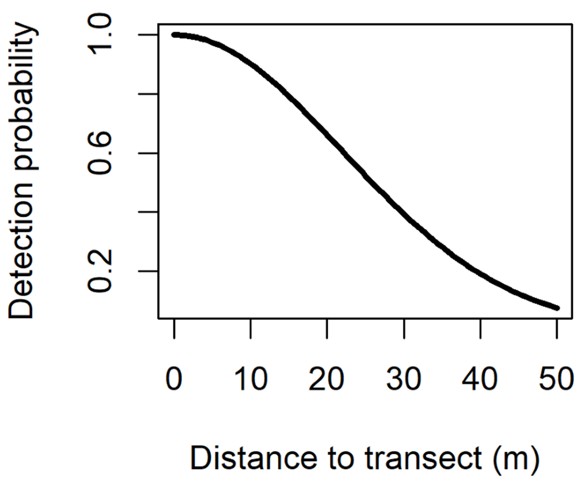

```{r setup, echo=FALSE, warning=FALSE}
knitr::opts_chunk$set(echo = TRUE)
```

```{r, include=FALSE}
options(tinytex.verbose = TRUE)
```

```{r, echo=FALSE, warning=FALSE}
library(knitr)
opts_chunk$set(tidy.opts=list(width.cutoff=50),tidy=TRUE)
```

```{css, echo=FALSE}
.scroll-200 {
  max-height: 200px;
  max-width: 100%;
  overflow-x: auto
  overflow-y: auto;
  background-color: inherit;
}
```

```{r echo=FALSE, include=FALSE, warning=FALSE}
library(unmarked)
#install.packages("bookdown")
library(bookdown)
library(ggplot2)
#install.packages("curl")
library(curl)
#install.packages("kableExtra")
library(kableExtra)
#install.packages("formatR")
library(formatR)
```

# Lab overview
This lab is designed to demonstrate distance sampling, a commonly-used technique for estimating animal abundance/density measured along transect lines or from fixed points. During each survey, observation of animals along the line (or at a point) are recorded along with a measure of their perpendicular distance from the line (Figure 1). We assume that animals on the line are detected perfectly (p=1.0), and that our ability to detect animals decreases as the animals are located further from the line (Figure 2). While distance sampling would typically be used to measure animal abundance, it can also be applied to plants, or even zombies. Our example today demonstrates how distance sampling could be used to measure zombie abundance in a hypothetical post-apocalyptic scenario. 




# Zombie Distance Analysis
For this assignment, we will be using data collected by survivors of a zombie apocalypse in the forests around the University of Maine. For undisclosed reasons, these survivors are interested in estimating zombie abundance in the local forest. The survivors ran two transects through the area, each 1000 m, and measured the distance from the transect line to each zombie that they spotted. The survivors were unable to measure any zombie that was over 50 m away from the transect.

The forests surrounding the University are composed of both coniferous and deciduous tree stands. One of the two transects was placed in a coniferous stand, while the other was placed in a deciduous stand (Figure 3). These two forest types may have an impact on zombie density, or the ease by which we can count zombies, and so we'll test for differences between these two transects later in the exercise.


First we need to input the distance data into R. You’ll find the data saved as the csv file ‘distall’ on Brightspace. It includes two columns of information. The first is the transect ID (given as Conif and Decid, based on the dominant forest type), and the second gives the distance for each observed zombie. 

Let's begin by using the read.csv() command provided to import the data. Remember that you will need to change the file path name to reflect the actual directory your file is stored in.

```{r echo=FALSE, results = FALSE, warning=FALSE}
zDIST <- read.csv("distall.csv")
```

```{r eval=FALSE, echo=TRUE}
zDIST <- read.csv("D:/Teaching/WLE 411/Lab 9/distall.csv")
```

Now we need to load the unmarked package. Do this by running the install.packages() and library() commands. As a reminder, the install.packages() function will only need to be run once on your computer, and you can skip this function when rerunning your code.

```{r eval=FALSE, echo=TRUE, warning=FALSE}
install.packages('unmarked')
library(unmarked)
```

We’re going to create a new column that that converts our transect ID from the "character" data type to a "factor" data type, which the unmarked package can recognize. Factors have an attribute called "levels", which list all unique values of the factor. In this example, the zDIST$transect factor only has two levels, Conif and Decid.

We will store the levels of our factor in a new dataframe, called covs, that we will use later in our analysis.

```{r echo=TRUE, results = FALSE, warning=FALSE}
zDIST$transect <- as.factor(zDIST$Transect.ID)

levels(zDIST$transect)

covs <- data.frame(Trans = levels(zDIST$transect))
```

Next we will create a data frame, yDat, which takes our transect measurements from zDIST and reformats them so they can be used in a distance sampling analysis. When you inspect the new dataframe you’ll notice that observations have been pooled into 5 discrete bins in 10 m increments, and they are separated among the two transect IDs. 

```{r echo=TRUE, results = FALSE, warning=FALSE}
yDat <- formatDistData(zDIST, distCol='Distance', 
                      transectNameCol='transect', dist.breaks=c(0,10,20,30,40,50))
View(yDat)
```

Using the yDat and covs data frames, we’ll construct an input file that will contain all the data for our distance sampling analysis. It will also include some other relevant information like transect length and the fact that this was a line-based sample, as opposed to point-based. 

```{r echo=TRUE, results = FALSE, warning=FALSE}
umfz <- unmarkedFrameDS(y=as.matrix(yDat), siteCovs=covs, survey="line",
                       dist.breaks=c(0,10,20,30,40,50), tlength=rep(1000,2),
                       unitsIn="m")
```

We can also produce a histogram of the data to show how detections varied based on distance from the transect line. Recall that in a distance analysis we assume that animal (zombie) distribution is random with respect to the line, but that our ability to detect the zombies decreases as we move away from the line. Hopefully your histogram is consistent with the latter assumption. 

Also notice that when you create these figures in the plot window you can export them as image files using the “Export” button. 

```{r echo=TRUE, results = FALSE, warning=FALSE, fig.keep = "none"}
hist(umfz, xlab="distance (m)", main="", cex.lab=0.8, cex.axis=0.8, freq=TRUE)
```

Our next step will be to identify the best distance-detection function given your data. Again, we assume that detection declines with distance from the line, however, the specific way that detection changes with distance can be variable among studies for a variety of reasons. For example, detection may be high very close to the line but then may very rapidly decline. This might occur in very dense vegetation or in highly variable terrain. In contrast detection may decline slowly and progressively with distance, for example in even terrain or with more moderate vegetation. There are three general distance-detection functions we can use to approximate this: the half normal, hazard, and negative exponential functions. If you run the code associated with this step, you can see what each of these three functions look like:

```{r echo=TRUE, results = FALSE, warning=FALSE, fig.keep = "none"}
# half-normal (hn) function
plot(function(x) gxhn(x, sigma=22), 0, 50,  col=45, lwd=3, ylab="detection prob.", xlab="distance")

# hazard (haz) function
plot(function(x) gxhaz(x, shape=10, scale=10), 0, 50, add=TRUE, col=20, lwd=3, ylab="detection prob.", xlab="distance")

# exponential (exp) function
plot(function(x) gxexp(x, rate=10), 0, 50, add=TRUE, lwd=3, ylab="detection prob.", xlab="distance")
```

Notice that the gxhn(), gxhax(), and gxexp() functions all contain different parameters. The half-normal is, like the name implies, half of a normal distribution which can be characterized by a single parameter, sigma (or the variance of the distribution). The hazard function requires two parameters that define the shape and scale of the curve, and the negative exponential requires one parameter describing the rate of decline. For the purpose of these examples I’ve defined these all arbitrarily with a value of 10 for each respective parameter. 

To test which of the three distance-detection functions are most appropriate given our data, we can run three null models and only change the shape of the distance-detection function. This will also be your first chance to run a distance model. Take a quick look at the code. Importantly, the ~1 ~1 component is where we define the structure of the model, and “1” defines an intercept-only model. The first term is associated with the detection parameter, and the second associated with the density parameter. Here we are creating three objects, each of them distance sampling models with an intercept-only structure on both detection and density parameters, where the only difference is the shape of the distance-detection function. 

Note – if you get an error message saying that the Hessian is singular, you can ignore it and move on. 

```{r echo=TRUE, results = FALSE, warning=FALSE}
hn_Null <- distsamp(~1 ~1, umfz, keyfun="halfnorm", output="density", unitsOut="ha")
haz_Null <- distsamp(~1 ~1, umfz, keyfun="hazard", output="density", unitsOut="ha")
exp_Null <- distsamp(~1 ~1, umfz, keyfun="exp", output="density", unitsOut="ha")
```

Now, using the same principles of AIC model selection that we’ve used in past weeks, we can compare the relative fit of our three alternative models, given our data. The first batch of code here combines the model results into a single object, null.fit, and the next three statements produce an AIC table, provides us with the parameter estimates from each model, and the third gives the standard errors for the estimates. You will want to check two different things with these results. First, use AIC to determine which model provides the best fit to the data. Second check the standard errors for each model to see that the parameters are actually being estimated. A returned value of “NaN” indicates convergence was not reached on the parameter, suggesting the data were insufficient to fit the model in general. Notice that “NA” means something different – that the specific parameter is not relevant to the given model. The “best” model will be the one that produces the lowest AIC score without encountering convergence issues.

```{r echo=TRUE, results = FALSE, warning=FALSE, message = FALSE}
# Create a "fit list" to compare the model results
null.fit<- fitList(hn_Null, haz_Null, exp_Null)

# This will give you AIC scores
AIC.null<- modSel(null.fit)
AIC.null

# This will give the coefficient (beta) estimates
coef.Null<- coef(null.fit)
coef.Null

# This will give the standard errors for the betas. 
SE.Null<- SE(null.fit)
SE.Null
```

After finding the best distance-detection function, the next step will be to test some other alternative models. Really here we only have one other variable to consider, and that is the difference between the deciduous and coniferous transect. The three lines of code given here each include a different combination of either running intercept-only structure to detection or density, or allowing detection and/or density to differ based on transect ID. Remember that the model structure is given by the notation ~ detection ~ density, where ~1 reflects a null model and ~Trans gives a model where either detection or density is allowed to differ based on the transect ID. 

```{r echo=TRUE, results = FALSE, warning=FALSE, message = FALSE}
Null <- distsamp(~1 ~1, umfz, keyfun="halfnorm", output="density", unitsOut="ha")
p.Trans <- distsamp(~Trans ~1, umfz, keyfun="halfnorm", output="density", unitsOut="ha")
N.Trans <- distsamp(~1 ~Trans, umfz, keyfun="halfnorm", output="density", unitsOut="ha")

# This will compile the three models and allow you to compare them using AIC

all.fit <- fitList(Null, p.Trans, N.Trans)

AIC.All <- modSel(all.fit)
AIC.All
```

To come full circle to previous weeks, the linear model for a ~Trans structure to the detection function would look something like the following:

\begin{equation}
  Detection = \beta_{0} + \beta_{1}*Transect
\end{equation}

where $\beta_{0}$ would be the model intercept, and $\beta_{1}$ is the effect of the transect ID on detection. Thus, when looking at the results of summary(p.Trans), detection for the coniferous transect is defined strictly by the intercept, while detection for the deciduous transect is defined as the intercept plus the TransDecid estimate value.

Based on your assessment of the AIC results and coefficient estimates from this 3-model set, determine whether there were differences in either zombie detection or density between the two transect lines, and what those differences were (i.e. which transect was higher or lower in detection or density, if at all). 

```{r echo=TRUE, results = FALSE, warning=FALSE}
summary(p.Trans)
summary(N.Trans)
```

A major objective of a distance analysis is to actually generate an estimate of density (animals per unit area) and abundance (total number along the transect line). For our distance analysis in unmarked, our actual response variable is density, and that is what our model results report. We will use the backTransform() function to produce and report the density estimate.

```{r echo=TRUE, results = FALSE, warning=FALSE}
Dens.Est <- backTransform(p.Trans, type="state")

Dens.Est
```

Next we can convert density into an actual estimate of the total number of zombies found along the transect lines. This will require doing a small amount of math to take the estimate of density and convert it to abundance given the size of the area we sampled. Remember the data are based on two 1000 meter transects, and our maximum distance was 50 m from the line. However, to compute the actual abundance of zombies we’ve got to first compute the effective transect width. This uses the distance-detection function to compute the actual functional area that we covered during the survey, accounting for the fact that detection declines as we move further away from the survey line. The ‘integrate’ function is what computes the area under the detection curve by, you guessed it, integrating the half-normal function.

```{r echo=TRUE, results = FALSE, warning=FALSE}
# First, we need to extract a parameter for our detection function

# To derive the appropriate sigma value, use the following code:

Det.Est <- backTransform(Null, type="det")

sigma.est <- Det.Est@estimate

# Then we need to calculate the effective transect width
# 50 represents the maximum distnace from the transect line that we could observe a zombie

eshw <- integrate(gxhn, 0, 50, sigma=sigma.est)$value
```

Based on the effective width we can convert density to an estimate of abundance for each transect, and a combined abundance estimate for the surveyed area.

```{r echo=TRUE, results = FALSE, warning=FALSE}
# This returns the density for each transect 

Site.Density <- predict(p.Trans, type="state")$Predicted

# This computes the plot area based on the effective survey half-width, transect lenght (100m)
# and the fact that their are two halves of the transect.  The division by 10000 converts to HA

plotArea <- eshw*1000*2/10000

# This gives the abundance for the two transects

Site.Abundance <- (Site.Density)*plotArea*2

# and the total abundance is based on the two halves.  

N.hat <- sum(Site.Abundance)
N.hat
```

Finally, we can plot the detection estimates to produce a distance-detection graph.

```{r echo=TRUE, results = FALSE, warning=FALSE, fig.keep = "none"}
# Lastly, lets plot our distance-detection function.  First we need to pull the 
# estimate of our detection parameters.  

Det.Est<- backTransform(Null, type="det") 
Det.Est

# Next, we can plot the histogram of detections by distance. But the following
# code will scale the y-axis between 1.0 and 0.0.

h = hist(umfz)
h$dens = (h$counts/sum(h$counts))
h$density = (h$dens/max(h$dens))
plot(h, freq=F, xlab="distance (m)", main="", cex.lab=0.8, cex.axis=0.8)

# Finally, we can plot the detection curve on our histogram. 

# Use this for a half-normal function
plot(function(x) gxhn(x, sigma=sigma.est), 0, 50, lwd=2, add=TRUE, col=26)
```

# Assignment

We just ran a fairly involved Distance Sampling analysis in program R. During the lab, you assessed the appropriate distance-detection function, evaluated support for differences among the two transect lines, estimated the abundance of zombies along the transect lines, and plotted your detection functions. Based on what you’ve learned, answer/complete the following questions and turn them in as the assignment for this week, along with the R script used in this lab.

1. Which distance-detection function did you find was best supported by the data? What does the shape of this function imply about your ability to detect zombies in the Maine woods? Please include with this answer the AIC table that summarized the results of your three distance-detection models, and your final histogram/detection curve plot. Please format your AIC table as specified in the formatting guidelines for the course. Note that plot can be saved as .jpeg files using the “Export” feature in the graphing window. The plot exported from R does not need to follow the course's normal formatting guidelines for figures.

2. A colleague of yours working in a major urban area (e.g. Portland) collected similar data, and found that a hazard function with a shape parameter=3.9 and a scale parameter=8.2 best fit the zombie distance-detection relationship in her system. What does this imply about zombie detection in an urban setting versus what we found in a forest environment? How would that information be relevant for survival during a zombie viral outbreak?

3. Did you find any differences among the two transect lines with respect to density or detection? If so, what were those differences? Use supporting information from your AIC table or parameter estimates to support your answer, and also include your final AIC table (the second one from the analysis).

4. What was your final estimate of zombie abundance? What was your estimate of zombie density? If we surveyed a 100 ha woodlot, what would you predict was the total abundance of zombies within the entire woodlot? What inherent assumption are you making when extrapolating the estimates from your two transect lines to the woodlot as a whole?

# Appendix

The following code can be used to export AIC tables from the unmarked package into csv format. As always, remember to modify the file paths to ensure that these files write to the correct location on your computer.

```{r eval=FALSE, echo=TRUE, warning=FALSE}
AIC.table<- as(AIC.null, "data.frame")
write.table(AIC.table, "C:/Users/labuser/Desktop/distAIC.csv", sep=",", row.names=FALSE)

## Table 2
AIC.table2 <- as(AIC.All, "data.frame")
write.table(AIC.table2, "C:/Users/labuser/Desktop/allAIC.csv", sep=",", row.names=FALSE)
```

