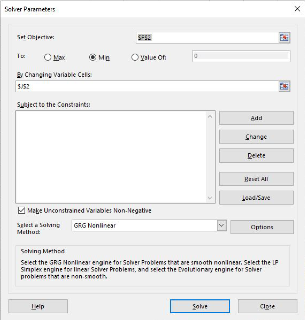

```{r setup, include=FALSE, warning = FALSE}
knitr::opts_chunk$set(echo = TRUE)
```

```{r, echo=FALSE, warning = FALSE}
library(knitr)
opts_chunk$set(tidy.opts=list(width.cutoff=60),tidy=TRUE)
```

```{css, echo=FALSE}
.scroll-200 {
  max-height: 200px;
  max-width: 100%;
  overflow-x: auto
  overflow-y: auto;
  background-color: inherit;
}
```

```{r echo=FALSE, include=FALSE}
#install.packages("RMark")
library(RMark)
#install.packages("bookdown")
library(bookdown)
library(ggplot2)
#install.packages('curl')
library(curl)
#install.packages("kableExtra")
library(kableExtra)

cleanup(ask=FALSE)

```
# Lab Overview

Last week we used both the exponential and logistic models to predict population trajectories, using a growth rate ($r$ or $\lambda$) that we derived from presumed birth and death rates. This week, we’ll work backwards, using count data that provide an **index** to abundance to estimate the growth rate for a population over a given period of time.  This will be a very simple example of what is referred to as time-series analysis, which is any analysis that uses data collected sequentially through time and attempts to derive statistical measures of how the data has changed during that time period.  In this case, our data will be population counts and the change we are interested in, $r$, gives us a metric that describes the trajectory of the population, or the population trend.   

## Learning objectives

1) Provide experience using linear regression to quantify population growth rates from time series of counts.  

2) Increase your comfort level in interpreting the outputs of analyses conducted via statistical software. 

3) Improved understanding of the importance of time scales to population trend assessment.

## A regression refresher

We've talked about linear regression and its principles at least once already this semester, during the first week of lecture when we discussed modeling from a general perspective (recall the clutch size example). We will also go on to use these regression-based concepts later in the semester, so its important that we get them to stick. Recall that a basic form of a regression is often presented as

\begin{equation}
  \label{eq:1}
  Y_{i}=a + bX_{i}
\end{equation}

where $Y_i$ is the response or dependent variable, $X_i$ is the predictor or independent variable, *a* provides the model intercept, or the expected value of $Y$ when $X=0$, and *b* gives the slope coefficient, or the effect of a 1-unit change in the predictor on the expected response.  Now, let's take another look at our now familiar continuous exponential growth model.

\begin{equation}
  \label{eq:2}
  N_{t}=N_{0}e^{rt}
\end{equation}

It turns out, that a mathematically equivalent version of the continuous exponential model is given as

\begin{equation}
  \label{eq:3}
  ln(N_{t})=ln(N_{0})+rt
\end{equation}

where we've natural-log transformed the two abundance terms, and now the product of *r* and *t* are added to the $ln(N_{0})$ rather than using $e^{rt}$.  Compare carefully equations 1 and 3 - they are basically the same!  Our $N_0$ term is conceptually equivalent to the model intercept, *a*, in that it reflects the value of $N$ when $t=0$.  $t$, by logical extension, is our $X$ equivalent, and $r$ is our slope, or the expected change in $N$ given a change in $t$. The natural log transformations of $N_{t}$ and $N_0$ make the math work, and they also mean that if we fit a linear regression to count data that have been ln() transformed, the resulting slope that is estimated from the regression will give us an equivalent value to $r$. Thus, we can use regression as an additional tool to obtain a population growth rate from a time series.

In WLE 220 (or a comparable introductory stats course) you learned how to derive estimates of $a$ and $b$ for a linear equation manually. Microsoft Excel will make these calculations for you using the Data Analysis tool pack, which we will enable below. The lab will also illustrate an alternative approach to deriving $r$ from the time series' using Excel's solver tool, which is a handy feature for you to know about in general.

> **_Sidebar - But Erik, this seems like a lot of work for something we already know how to do - _** If you're thinking to yourself that we've already learned we can estimate a population growth rate from counts as $\lambda=\frac{N_{t}}{N_{0}}^{1/t}$, you aren't wrong. But this approach offers a few benefits that make the trouble worthwhile and useful.  For example, by using regression we can not only quantify the population growth rate, but we can also take advantage of the statistical properties of the regression. Is the growth rate $r$ statistically different from $r=0$ (otherwise known as the regression's null hypothesis)? What is the standard error of $r$ as a measure of its precision? Also, this approach will tend to be a bit less sensitive to highly stochastic time series, where the starting and ending values of N will have much less sway on the trend estimates. Overall, evaluating population growth in this way is pretty standard practice, so well worth your time to learn!

# Getting Started

This exercise will be split into two parts. First, we will work with a series of count data collected across a relatively long time period (40 years), where there is some small annual variation in the annual growth rate but where growth was, for all practical purposes, constant. In the second part we will work with a somewhat messier time series collected over a shorter, but still relatively long (20 years), time interval, and where the growth rate varies dramatically on a year-year basis (due to stochastic processes). We will explore how in this more stochastic system the length of time in the series influences the estimated growth rate, and the implications that has for making management recommendations.   

**_First steps:_**

1.	Retrieve the file “trend.xls” from the course website under the “Labs” tab. Save it your desktop or personal digital storage device.

2.	Open the file in Excel. You will see there are 2 worksheets labeled “Part 1” and “Part 2”.  

3.	Before you begin, we need to turn on two Excel options that will allow us to complete the exercises. From the File menu, choose the “Options” tab.  Click on the “Add-Ins” tab on the left side of the pop-up window.  At the bottom of the next window there is an option to “Manage Excel Add-ins” and a button that says “Go”. Click this.  In the next window that opens, check the boxes next to the “Analysis ToolPak”, “Analysis ToolPak - VBA”, and “Solver Add-in”. Click OK.

4.	From the top Menu bar, choose the Data tab, and you should see the Data Analysis and Solver options on the right hand side of the Menu Bar under the Data Menu.  If not, please ask for assistance, otherwise proceed with the lab.  

*Note that these packages are included in the standard version of Excel, and should be available on any computer that has Excel.*    

# Lab Part 1 - Long-term growth of an introduced smallmouth bass population.

## Model system - Everyone's favorite bass

Smallmouth bass (*Micropterus dolomieu*) are a popular Maine gamefish that are not native to the state. Smallmouth were originally introduced during the 1800s, and have expanded widely (probably in part due to range expansion, but also due to intentional movements by people). This scenario (purely hypothetical) is designed to reflect a dataset that could have been collected on smallmouth populations in a closed system (such as a lake with no inlet/outlet) where bass were counted each year using a constant effort system. For field methods we’ll assume the same number of nets were deployed for a 1-week period each summer, and the total number of captured bass were recorded.The numbers here do not reflect a complete census, but rather an index to the abundance of bass in the lake. Later in the semester we will talk about the validity of indices and assumptions that are inherent to their use, but for the time being we’ll assume this index provides an accurate reflection of the number of bass in the lake during each year.  

In the “Part 1” tab, you will find the count data for the years 1965 to 2005. First, plot the time series to get an idea of how the population changed over the 40-year period. I recommend using a scatter plot for this exercise (but remove the markers and add connecting lines by right-clicking on the points and selecting “format data series”).  As an aside, plotting your data is always a good first step in any sort of analysis. 

Next, we’ll work through two different methods to estimate the intrinsic rate of increase ($r$) for this smallmouth bass population. First you will use the solver tool to derive an estimate of $r$ using the continuous exponential model, and second you will use a more direct method based on linear regression. As you recall from lecture, we can easily convert between r and $\lambda$, and both metrics provide us with an assessment of the trend contained in these count data.

## Part 1 instructions

1.	First we need to use _equation \ref{eq:2}_ to predict the abundance in each time step. This should be old-hat for you by now based on the exercises we completed last week, except that in this case we don’t know what the appropriate value for r is; that is what we want to estimate from our data. However, we can use a series of steps to identify the value of r that maximizes the fit between the exponential model and our observed data.  First, place a haphazard value for r in cell J2 (green highlighted) next to the cell labeled “r-solver”. This can be anything, but you should probably make sure it’s a plausible value, say somewhere between -0.2 and 0.2. 

2.	Using the value for r you just created, apply _equation \ref{eq:2}_ to predict the abundance of bass in each year of the in column D, the column labeled “Expected”, assuming a starting abundance of 1200 bass.  Notice that “t” needs to reflect the number of time steps beginning with time t=0 (1965 in this case) and counting up to t=40 (2005).  See if you can figure out an easy way to modify your Excel formula so that _equation \ref{eq:2}_ can use the values for calendar year that are listed in column A.  If your model doesn’t return values that are in the same ballpark of our realized counts (for example if you get values that are in the millions), you’ve done something wrong.  If you get completely stuck at this step, ask for help, and also be sure to pay close attention to your anchoring of cell references and orders of operation. 

3.	You’ve now got a series of estimated abundances derived from the continuous exponential model and your haphazard guestimate of $r$, as well as a realized set of catch data from the netting efforts.  We can calculate the degree to which these two series differ from each other using the Mean Squared Error (MSE), which will provide a measure of how well our expected values match the realized patterns in the data, given the value of $r$ that we’ve placed in J2. MSE is a very standard calculation to evaluate fit between a series of observed and expected data values, and is given by the equation:

\begin{equation}
  \label{eq:4}
  MSE=\frac{\sum_{i=2}^{J}(Exp_i-Obs_i)^2}{J}
\end{equation}

Where in our case “Exp” is the expected value based on our continuous exponential model (column D), “Obs” is the observed value from our catch data (column B), “i” reflects each individual year in the time series, and “J” is the total number of years between i=2 and the end of the series (J=40).  The “i=2” term in front of the summation symbol indicates that you should start the calculation in year 2 of the time series (1966) and continue the end of the series, “J”, which represents the value for 2005.   NOTE: Even though 1965 represents year 0, “i” refers to the year’s position in the time series, which for 1965 would reflect $i=1$ (there is no $i=0$).

4.	The easiest way to apply  _equation \ref{eq:4}_ in our spreadsheet will be to first calculate the numerator component of the equation $(Exp_i-Obs_i)^2$ for each level of i, or each year.  Do this in column E. 

5.	Once you’ve computed the numerator value for each level of i, you can calculate a single MSE value in cell F2 using on the sum of all the $(Exp_i-Obs_i)^2$ values, and J=40.  In other words, apply _equation \ref{eq:4}_ as a formula in cell F2. Remember that we want to start with $i=2$ and not $i=1$ (think about why this is).  You should be left with a relatively large number of some sort for MSE.  

6.	So now we’ve got a fully linked spreadsheet that will change our expected estimates of N, and therefore our MSE, as we alter our value for r-solver in cell J2.  Go ahead and try changing this value a handful of times to see how your MSE changes.  A smaller MSE value means there is tighter agreement (less error) between the model and the observed data, so as you change r you can get a sense for whether you are getting 'hotter' or 'colder' as you go.

7.	We could keep trying different iterations of r until we arrive at the smallest possible value of MSE, but that would be tedious.  Instead, we can take advantage of Excel’s Solver tool to do the iterations for us.  From the Data tab, choose the Solver option.  From the Solver window, set the 'objective cell' (what we want to solve for – the smallest MSE value) to F2 for your MSE term, specify that we want to obtain the minimum value for MSE, and specify that we want to achieve that minimum value by changing cell J2, our guestimate of r.  Click “Solve”.




8.	Solver should rapidly crank through a large number of iterations, then present you with a dialog box – select “Keep solver solution” and hit “OK.” It will then give you a solution in cell J2 for the value of $r$ that maximizes the fit (based on MSE) between the observed catches of fish and the expected value based on the continuous exponential.  This is our first estimate of the intrinsic rate of increase for our smallmouth bass population. If you find that solver cannot find a solution, or it returns something nonsensical, like all 0s in your expected values, it means you have an error in your spreadsheet somewhere.  

9.	Next, we’ll use our count data to derive a second estimate for $r$ directly.  First, we need to transform the count data using a natural log transformation, which will place our index on a log-scale and allow us to estimate the rate of change using linear regression. Use the LN() function to transform the catch values in column B to log-transformed values in column C.  

10.	Now we can use our log-transformed counts to regress the response variable (ln-transformed count) by a predictor variable (time, or year). From the Data Tab, click on the Data Analysis icon (in the “Analysis” section of the toolbar) and choose the “Regression” option.  

11.	From the Regression window, choose the range of data that reflects your $Y$ and $X$ variables. If you’ve read the information contained in the lab introduction carefully, then the data ranges you need to specify should be intuitive.  

12.	For the “Output options”, select Output Range and type H4 into the adjacent field.  You can leave all other options at the default, and click ok. 

13.	You should be left with a large block of statistical output from the regression.  Based on your careful reading of of the lab introduction, and what you recall from your stats course(s), identify the intrinsic rate of increase from this analysis and copy it to cell J1, the blue highlighted cell for the r value from the regression. How does this estimate compare to the estimated value for r that you derived using Solver?  

> **_Sidebar - So you're still stuck on finding r - _** I totally get that Excel just spit a bunch of numbers at you, and it's tricky to figure out what they all mean.  But I also leave this portion of the lab purposfully vague, because I really want you to think through this, and in general, I think there's a lot of value to remaining calm when you're faced with a large chunk of unfamiliar statistical output that you need to make sense of.  Recall that we are ultimately using the regression to illustrate for us the effect of time (years) on predicted abundance, and $r$ is represented by the slope coefficient of the regression.  If that doesn't help, also remember that Excel has a help file library, and Google is also your friend.   

14.  Let's take a second to appreciate the connection between your regression output, which applies _equation \ref{eq:1}_, and how this translates to _equation \ref{eq:3}_.  Because we have applied the ln() transformation to our count data, the intercept ($a$ in eq. 1) is identical to the $\ln(N_0)$ term in eq. 3.  Similarly, the slope coefficient from the regression ($b$ term from eq. 1) is giving us an equivalent of $r$ from eq. 3.  When you specified the 'y-variable' in fitting the regression, you used the equivalent of $\ln(N_t)$ in your column C data.  Moving forward with part 2, you will apply these exact same principles in estimating sage-grouse population dynamics.

# Lab Part 2 - Evaluating population trends in the presence of high annual variation 

In lecture we’ve discussed a number of sources of stochastic variation in population growth, whether we’re working under the assumptions of the exponential or logistic growth models. In reality, these stochastic processes cause populations to experience dramatic year-to-year changes in abundance outside of their general long-term trends.  Populations that are stable or increasing may experience periodic declines, and populations that are impacted by real long-term declines in abundance may periodically increase. This complicates our ability as managers to evaluate population status because we’ve got to disentangle the year-to-year noise due to stochasticity from the true trends in abundance that occur at longer time scales. This is why “long-term” datasets are extremely valuable for making inferences about conservation status, because the large number of years will allow us to determine the true underlying trend independent of the short-term variation.   

## Model system - the coolest bird in the west

This exercise will use greater sage-grouse (*Centrocercus urophasianus*) as an example species, which I think is timely because as recently as 2015 the US Fish and Wildlife Service decided that greater sage-grouse do not warrant Federal protection under the Endangered Species Act.  The decision to not provide sage-grouse with ESA protection, and the justification for considering them as an endangered species to begin with, was based at least in part on trends in sage-grouse abundance that have been estimated from counts of males displaying in the spring on breeding areas called leks.  The courtship display of male sage-grouse is very conspicuous, and leks are normally found in relatively open areas with little vegetation, making males easy to count and use as an index to abundance (again, we’ll cover issues related to indices later in the semester). Because of this, lek count data are available to evaluate long-term trends in sage-grouse abundance from as early as the 1960s. 

As a total aside, give yourself just a few minutes' break and navigate to the video [available at this link ](https://www.youtube.com/watch?v=aOEmoC5hSHQ) to gain a bit more perspective of the species and the ecosystem, as well as what its like to visit a sage-grouse lek, courtesy of the Cornell Lab of Ornithology. 

Please realize that the numbers I am giving you for this exercise are entirely fictional, but the year-to-year variation is fairly representative of the variability that we commonly see in sage-grouse lek counts.  “Counts” in this case are the average number of males observed per lek each year (males/lek), which partially allows for different numbers of leks to be counted each year (think about why a lek-level average compensates for changes in effort – and what assumptions are being made when doing so). We will assume for the sake of this exercise that you are a state biologist tasked with evaluating population trends of sage-grouse in your district, and with making recommendations about whether sage-grouse populations in your district warrant special protection and/or conservation focus. You should base this assessment on whether you believe the population is declining, increasing, or stable.  

## Part 2 instructions

1.	Open the sheet labeled Part 2.  Here you will find a series of counts that give the average number of males counted per lek from the period of 1995 until 2015, a 21-year time series. 

2.	First, graph the time series to get an appreciation for the general pattern in these data. Again, I recommend using a scatterplot, with year defining the x-data, and Males/lek defining the y-data.  Using a scatter plot, as opposed to a line graph, will make some of the later steps easier.  Although this will be a scatter plot (points only), you should also add a line to the time series to illustrate the year-to-year change.  

3.	Following the same steps that we used in Part 1, evaluate the 20-year trend of this sage-grouse population **using the linear regression technique**. Although these data conform to the principles of exponential growth (in that there is no density-dependent structure), their stochastic nature will make use of the solver method more difficult. Again, **there is no need to repeat the solver method here, only regression**. In completing this step, you'll need to first $ln()$ transform the sage-grouse counts, and then run your regression on the transformed count data.  If you find yourself searching for a value of $r$ to apply in completing this step, you're probably confusing the regression analysis with steps associated with the solver approach in part 1. 

> **_Sidebar - don't forget about lambda! - _** We are going to be estimating r from our regressions, but notice also that for this week’s assignment I ask you to report your population trend estimates based on the geometric growth rate, $\lambda$, so you will need to make the appropriate conversion from the continuous growth rate r that you derive from the regression when completing the assignment. 

4.	Once you have the regression output for the 20-year time series, add a trend line to the graph to illustrate your estimate of the 20-year trend.  Although Excel will do this for you, I’d like you to use your regression results to create your own trend line, which will hopefully illustrate how a regression can be used to facilitate predictions. Recall from part 1 that _equation \ref{eq:1}_ provides the regression equation, which can be used to predict Y for a given value of X. In this case, the X value is year, and you can use it plus the intercept (*a*) and coefficient (*b*) terms from the linear regression output to predict a value of $ln(count)$ (the Y response variable) for each year.  These values won’t match our realized $ln(count)$ values, because they predict the trend in counts across years, and not the realized counts in any given year. But, this will allow you to present a graphical representation of the general trend in the data across the 20-year period. In column D under the label “Predicted LN(20)”, use equation 1 and the outputs from your regression to predict the $ln(count)$ value for each year. You’ll know you’ve done this correctly if the predicted values fall at least within the ballpark of the $ln(count)$ values in column C.

5.	Next, you’ll need to back transform these estimates, which remember are on a log-scale, to get them back to the actual units of males/lek so that we can plot them on our graph.  To do this, simply use the exp() function to transform the values.  Place this in column E under the “Pred20” label, which stands for the predicted counts across the 20-year time series.  Again, you’ll know you’re right if the values you get are in the same ballpark as our original lek count values.  

6.	Once you’ve successfully generated your trend values, add them to your graph to illustrate the general trend in abundance, based on your regression, during the 20-year time series.  Do this by right-clicking on the graphed line and selecting “Select data,” then click on “add” in the left side of the dialog box to add the new data series. At this point you should have a graph that looks something like this:


7.	Once you’ve obtained the trend for the full 20-year time series, and have added its predictions to your graph, I’d also like you to estimate the growth rates and graph the 10-year trends for individual periods between 1995-2004 and 2005-2015.  This will require that you conduct two additional regressions. Put the first new regression output in cell H26 and the second in H47 – if you don’t remember to change this, Excel will paste your new output over your old output. Then use the intercept and coefficient terms in each to predict trend estimates for each respective period, and fill in the predicted values in columns F (the log-transformed estimates) and G (the back-transformed estimates) just as you did in steps 4-6 above). Your completed graph should contain the 20-year time series and 3 predicted trends: 1 for the full 20 year series, one for the first 10 years (1995-2004) and one for the last 11 years (2005-2015), with each trend line identified using different symbols or shadings so we can tell them apart.  If you’ve used a scatterplot graph type you should be able to accomplish this. NOTE: It will help to add the 10-year trends as two separate new series.

8.	Finally, I’d like you to do one more regression (I promise this is the last one) where you only consider the 10-year time series from 2005-2014 (i.e. exclude the 2015 count from your analysis).  You do not need to add this trend to your figure, but you will be asked to interpret the differences in estimated growth rates when 10 vs. 11 years are included in the time series.  Put the regression results in cell H68.

Use the results of this trend estimation exercise to answer questions related to Part 2 for this week’s assignment.  


## Part 3 exercise - try it in R

For this week's R exercise, I would like to illustrate how we can accomplish the same feats of regression you just completed for greater sage-grouse with a bunch of button clicking in Excel, but instead using R to automate the analysis.  For this, we will simply estimate the 20-year trend from the sage-grouse data, and graph the relationship  

1. First, you'll need to import the sage-grouse data from Part 2 into R. Use the read.csv() command that we covered in Part 3 of Lab 2; it's the same process. First, you will need to copy **only columns A and B** from Part 2, paste them into a new file, and save them as a .csv.  These are the same steps described on page 9 of Lab 2.  When you import your data file into R, give it the object name sagegrouse (be mindful of all lower case).

```{r eval=TRUE, echo=FALSE, warning=FALSE, error=FALSE, message=FALSE, tidy=TRUE, results='markup'}

sagegrouse<- read.csv('sagegrouse.csv')

```

2. Once you have the data loaded and named sagegrouse, we will want to re-name the column headings to make them a bit easier to work with.  We'll use the colnames() command to do this.

```{r eval=TRUE, echo=TRUE, warning=FALSE, error=FALSE, message=FALSE, tidy=TRUE, results='markup'}

colnames(sagegrouse)<- c("year", "males")

## take a look at your data

sagegrouse


```

2. Next, we'll progress through the same workflow we did in Excel, but using a few base R commands to replicate the same processes.  First, let's add a new column to the dataframe for the ln-transformed count values using the log() command. In the code that follows, by specifying sagegrouse$ln.males, I am creating a new column in sagegrouse labeled 'ln.males'. I will also include a line of code to print your dataset each time in the console window.  You don't have to do this step, but as a general rule it's not a bad idea to check your data each time you perform an operation. 

```{r eval=TRUE, echo=TRUE, warning=FALSE, error=FALSE, message=FALSE, tidy=TRUE, results='markup'}

sagegrouse$ln.males<- log(sagegrouse$males)
  
## take a look at your data

sagegrouse


```

3.  Now, we can run our regression using the command lm(), which stands for linear model. Run the code below, look at the model output, which we execute using the summary() command, and compare it with your results from step 3 in Part 2 above. You should find they are similar if not identical - although the syntax provided in the results may vary, which gets back to my earlier point about being comfortable interpreting stats output from various packages.

```{r eval=TRUE, echo=TRUE, warning=FALSE, error=FALSE, message=FALSE, tidy=TRUE, results='hide'}

# this runs the regression

sagegrouse.20.lm<- lm(data=sagegrouse, ln.males~year)

# prints the results

summary(sagegrouse.20.lm)

```

3 (cont).  Notice that because I assigned my regression to a new object, named sagegrouse.20.lm, the results of my analysis are saved in that object and I can recall them at any time. Also, to break down the code a little, the syntax for this command to fit the regression is y~x, which is reflected in the ln.males~year structure above. The command interprets this as equivalent to _equation \ref{eq:1}_, and assumes a model intercept (we don't include that in the code) which you'll see reported in the results. 

4.  OK, now we have results from our regression, and as in part 2 we can use them to predict the population trend for the 20-year period. This will actually be a bit less difficult than in Excel, because in R the predict() function completes the same operations as step 4, and we can easily use the exp() function to perform the back-transformation in step 5. Compare the workflow below to the steps you took in #4 and #5 of part 2.

```{r eval=TRUE, echo=TRUE, warning=FALSE, error=FALSE, message=FALSE, tidy=TRUE, results='markup'}

# create a new column with the predictions as in step 4 of part 2.

sagegrouse$pred.ln.20<- predict(sagegrouse.20.lm)

# and back-transform these as in step 5 of part 2

sagegrouse$pred20<- exp(sagegrouse$pred.ln.20)

# take a look and compare to your spreadsheet

sagegrouse

```


5. And lastly, we can use ggplot, which you were exposed to in Lab 2, to graph our counts and predicted trend, which should look pretty darn similar to your excel-based figure.

```{r eval=TRUE, echo=TRUE, warning=FALSE, error=FALSE, message=FALSE, tidy=TRUE, results='markup'}
library(ggplot2)

ggplot(data=sagegrouse, aes(x=year, y=males)) +
  geom_point(size=2)+
  geom_line()+
  geom_line(aes(x=year, y=pred20), linetype='dashed')+
  ylab("Males per lek")+
  xlab("")+
  theme_classic()
```


# The Three Big Things You Should Have Learned Today

**FIRST** How to apply a linear regression to a time series to estimate a population growth rate equivalent to the intrinsic rate of increase, r. 


**SECOND** How to use the solver tool in Excel, and how to use and interpret the linear regression option from the data analysis toolpack in excel.

**THIRD** How our assessments of population trend can be VERY sensitive to the number of years in our time series. 


# Lab 3 Assignment

Your assignment for this lab will be to complete and turn in the following questions related to Parts 1 and 2 of the lab. In the case of this lab some of the questions will be best answered in essay format. Please submit your completed assignment as a Word document, due before the beginning of next week’s lab, as well as your completed spreadsheet and R script, via Brightspace.

**Part 1**

1.	Below please paste an appropriately formatted figure showing the time series of smallmouth bass abundance for our hypothetical lake system. Follow figure conventions outlined in the Lab 1 assignment, and also provide a complete written figure caption below the figure.  Figure captions are typically placed below a figure, whereas table titles are provided as a heading and are placed above.  

2.	Based strictly on this figure, do you believe the smallmouth population is experiencing exponential growth? Why or why not? 

**Part 2**  *Note – please complete questions 1-3 fully before moving on to question 4 and 5.*


1.	Produce a table that shows the predicted annual intrinsic ($r$) and discrete growth rates ($\lambda$) for the full 20-year time series, and for each of the 1995-2004, 2005-2015, and 2005-2014 time series. Use appropriate column headings and labels for each observation so that the table is easy to read. Your table should be formatted in 12-point Times New Roman font and use the following general format for borders, bolding, and spacing (see example below). Notice that column headings and labels for individual observations are left-justified, whereas values in the data field of the table (the things you actually measured and/or estimated) are right justified.  You should also provide a title/heading for your table.


2.	Provide the figure you created showing the time series of counts and the three projected trends.  Follow figure formatting conventions as outlined above and in Lab 1. 
  
3.	Based on the population growth rates that you derived for the 20-year time series, as well as for the 10- and 11-year series, provide your assessment of the sage-grouse population status in your management unit. Do you feel that additional protections and conservation measures are justified, and why or why not?  

4.	What differences did you find when you estimated the population trend for the 2005-2015 time series versus the 2005-2014 series?  What are the implications of this result for evaluating population trajectories and interpreting time series in general? 

5.	On the Readings page on Brightspace you will find a file titled “WAFWA Press Release”. To finish your assignment for this week’s lab I’d like you to read that document, and then provide a short critique of the information provided by the press release. You should use what you’ve learned in this lab about time series analysis in crafting your critique. A paragraph (say ~150 words) should suffice.  


# Lab Appendix

## Quick reference for important R commands in this lab

We learned to use the lm() command to conduct a linear regression in R.  When created as an object, you can access your lm() results using the summary() command.


```{r eval=FALSE, echo=TRUE, warning=FALSE, error=FALSE, message=FALSE, tidy=TRUE, results='markup'}

Regression.model.name <- lm(data=data.name, y~x)

summary(Regression.model.name)

```

We also used the predict() function to generate predictions from our model object:

```{r eval=FALSE, echo=TRUE, warning=FALSE, error=FALSE, message=FALSE, tidy=TRUE, results='markup'}

model.predictions <- predict(Regression.model.name)

```


## For more information

For a good gentle introduction to linear model concepts see [Chapter 6 in Powell and Gale's *Estimation of Parameters for Animal Populations*](https://1314e4a9-8867-c60d-f722-a57baeba6944.filesusr.com/ugd/95e73b_da887bd7cf6346b6975979ed52531425.pdf). This chapter gets into some more advanced concepts, such as link functions, that we will delve into in coming weeks.


In the most recent edition of the [*Wildlife Techniques Manual*](https://jhupbooks.press.jhu.edu/title/wildlife-techniques-manual) Johnson and Dinsmore give a nice overview of estimating population growth from time series data via regression in Chapter 14.

## Glossary of Terms

**Intercept** - The term in a regression that defines the expected value of $y$ when $x=0$. 

**Predictor variable** - Often referred to as the independent variable, the value in a regression that is assumed to affect the response variable.

**Response variable** - Often referred to as the dependent variable, the outcome of a regression or similar predictive statistical model.

**Slope coefficient** - The term in a linear regression, often denoted as $b$ or $\beta$ that predicts the change in $y$ as a function of a 1-unit change in $x$