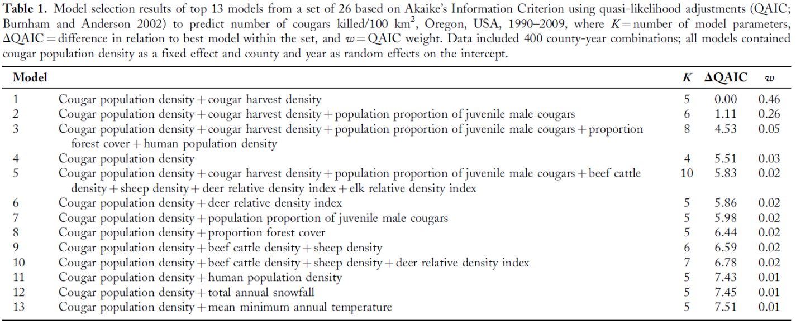

```{r setup, include=FALSE, warning = FALSE}
knitr::opts_chunk$set(echo = TRUE)
```

```{r, echo=FALSE, warning = FALSE}
library(knitr)
opts_chunk$set(tidy.opts=list(width.cutoff=60),tidy=TRUE)
```

```{css, echo=FALSE}
.scroll-200 {
max-height: 200px;
max-width: 100%;
overflow-x: auto
overflow-y: auto;
background-color: inherit;
}
```

```{r echo=FALSE, include=FALSE}
#install.packages("RMark")
library(RMark)
#install.packages("bookdown")
library(bookdown)
library(ggplot2)
#install.packages('curl')
library(curl)
#install.packages("kableExtra")
library(kableExtra)

cleanup(ask=FALSE)

```

# Maximum likelihood background

In this lab we’ll explore some of the fundamental principles of parameter estimation, and we’ll also discuss methods for hypothesis testing based on comparison of competing models. In doing so I’ll be introducing you to a fundamentally different statistical paradigm from what you’ve been exposed to in previous classes. One that involves making inferences based on comparison of multiple competing hypotheses, rather than the null versus alternative hypothesis testing framework you may be used to.

The software we will be using to estimate demographic parameters (Program MARK via the R package RMark – stay tuned for our next lab) uses a method for parameter estimation termed maximum likelihood estimation (MLE). The software uses computational search algorithms to derive MLEs, because often (although not always) the likelihoods themselves are too complex to be solved analytically using calculus. Instead, the computer essentially “tries out” a bunch of values and, through trial and error, eventually comes across the value that works best (remember in last week’s lab how you used the r-solver to find the value of r that minimized the mean square error value – same idea).

Today we will use a superficially similar approach to generate MLEs for binomial probability values in Microsoft Excel under a scenario that is centered on a coin flip. Coin flips are an example of a “Bernoulli Trial,” which is any test that has only two possible outcomes (e.g. heads or tails) and where a single probability distribution describes the probability of either outcome. Animal survival during a defined interval is also a Bernoulli trial; an animal can either survive the interval or not, and the survival probability and the mortality probability can effectively be defined by the same probability value (S vs. 1-S, respectively – i.e., if the animal has a 40% chance of surviving, then it has a 60% chance of dying). In situations where we can monitor animal survival with complete accuracy (such as with the use of radio collars) we can estimate survival probabilities using the same binomial likelihood functions that we’ll be working with today. However, in many cases, such as when we use tags or bands to mark animals that must then be recaptured, we have an imperfect ability to detect the mortality process (i.e., if we don’t recapture a tagged animal, that doesn’t necessarily mean it is dead), and we must incorporate a secondary term that defines the detection probability. At this point two parameters are needed to describe the likelihood of observing the data; the survival parameter and the detection parameter. In these cases, we will need to use a multinomial likelihood, and we will discuss these in greater detail during future classes.

The first step in calculating a binomial probability is to compute a binomial coefficient, which gives the total number of possible ways we can obtain a particular result from a series of Bernoulli trials (y; for example, number of coin flips resulting in a heads) given that we conducted N total trials (i.e. how many times was the coin flipped). The N over y notation below is read as the number of ways we can observe y results from N trials.

\begin{equation}
\label{eq:1}
\begin{pmatrix} 
N \\
y 
\end{pmatrix}
=
\frac{N!}{y!(N-y)!}
\end{equation}

Where in this equation, the use of exclamation marks, “!” indicates a factorial, which is used to signify the product of all positive integers less than or equal to N. For example, if N=4, then 4! would be given as 4x3x2x1=24. If we were interested in calculating the binomial coefficient for a scenario where we got one “heads” out of two coin flips, we would solve this equation like this:

\begin{equation}
\label{eq:2}
\begin{pmatrix} 
2 \\
1 
\end{pmatrix}
=
\frac{2!}{1!(2-1)!}
=
\frac{2*1}{1(1)}
=
2
\end{equation}

This should agree with our intuition – there are two possible ways we can get one “heads” out of two coin flips: either the first flip is heads (and the second is tails) OR the second flip is heads (and the first is tails). IMPORTANTLY, when you see a binomial coefficient in an equation, recognize it is not asking you to divide N by y, as there is no division sign in the term. Instead, you should replace the binomial coefficient with Eq. 1.

We next include the binomial coefficient in a likelihood function for a potential probability value, given that we conducted N number of trials (flips) and observed y successful trials (heads).

\begin{equation}
\label{eq:3}
L(p | N, y) 
=
\begin{pmatrix} 
N \\
y 
\end{pmatrix}
p^{y} (1-p)^{N-y}
\end{equation}

Here, we substitute the value we obtained from equation 1 for the N over y component of equation 2. The left side of the equation is read as the “likelihood” (L) of the probability value p, given the data (N, y). That is to say, the likelihood that a given probability value p accurately describes the probability of obtaining y successes in N trials. In this sense, p reflects our “model” of the Bernoulli process in question. In coin flip terminology, this might correspond with the likelihood that a coin is fair, where under a fair coin hypothesis our model would be defined as p=0.50. If we conducted a certain number of flips (i.e. collected data), and some number of them resulted in “heads”, we could then test the fairness of the coin model using the likelihood statement above.

To continue the example of two coin flips from above, we could test whether our coin from the calculation above was fair as:

\begin{equation}
\label{eq:4}
L(0.5 | 2, 1) 
=
\begin{pmatrix} 
2 \\
1 
\end{pmatrix}
0.5^{1} (1-0.5)^{2-1}
=
(2)(0.5)(0.5^{1})
=
0.5
\end{equation}

Where a value of 0.5, or 50%, is exactly what we’d expect for a fair coin. We could also test an alternative hypothesis that the coin was not fair using different models, for example p=0.40, which would indicate the coin was biased towards producing tails, or p=0.60 which would indicate that the coin was biased towards heads. This is what you will be doing in lab today. In each case however, we need a statistical criterion for helping us to determine whether the different likelihood values that we derive are truly different from one another, and which one is best supported, given the inherent uncertainty in our data. For this we will use Akaike’s Information Criterion, or AIC.

# AIC Hypothesis Testing

In prior courses you’ve used what are termed “frequentist” approaches to making statistical inference. For example, using a t-test to evaluate the hypothesis that the mean of some quantity differs “significantly” between two groups. In this case you are conducting an implicit test for support among two hypotheses: the null hypothesis states there will be no difference in mean values between the two groups, and the alternative hypothesis predicts that there will be a difference. Based on an a-priori value for alpha (e.g. 0.05), you then use a model p-value to determine whether or not the null hypothesis can be refuted and the alternative hypothesis accepted. Although these methods are widely used in the sciences, and in many cases can be entirely appropriate, there are other situations in which they can be easily misapplied or misinterpreted, and often may fail to take full advantage of the information contained in the data and hamper our ability to draw statistical inference.

For the remainder of this class, we will make use of a new statistical paradigm termed AIC. When we use AIC for hypothesis testing, we move past making comparisons among null and alternative hypotheses, and instead acknowledge that multiple competing explanations may exist for the phenomena we observe. In fact, we recognize that it may ultimately be very insightful to evaluate support among multiple competing hypotheses. Thus, we will compare the relative support for competing hypotheses, each of which are represented by an alternative model that attempts to describe observed patterns in the data. The model likelihood tells us how well the model fits the collected data, and a comparison among models using AIC provides a statistical determination of whether the likelihood values are statistically different among models, and which models provide the ‘best’ fit to the data. In doing so we also formally acknowledge that there is uncertainty in our ability to model our phenomena in question, and so we may ultimately find that we cannot conclusively determine whether a single one of our models represents the best model fit to the data. To make these comparisons we will compute an AIC statistic using the likelihood that we derive for each model, and we will use AIC to derive several other metrics that will allow us to make formal comparisons among models.

Calculating AIC requires that we’ve first computed a model likelihood (although AIC can also be derived based on a residual sum of squares). Today, we’ll be calculating the likelihoods for competing models ourselves in Excel, but in practice most statistical software (including Program MARK) will derive AIC from a model likelihood for you. AIC is given as:

\begin{equation}
\label{eq:5}
AIC = -2 ln(L(\hat{\theta}|data)) + 2K
\end{equation}

Where we take the natural log (ln) of the model likelihood and multiply it by a value of negative 2, and then add a second term of plus 2K. Here, K represents the number of parameters in the model. In the case of the coin flip, we only have one parameter, the probability of heads, thus K=1. Notice that the likelihood statement looks slightly different here compared to **_equation \textcolor{red}{\ref{eq:3}}_** above, but in both situations we have the likelihood of a parameter (theta-hat here, p in Eq. 3) given patterns in data we’ve collected (N and y in Eq. 3).

Among a set of competing models, the model with the smallest value for AIC is said to be the “best” model of the candidate set. That is to say, it produces the best fit of the model to the observed data. The +2K term on the back end of the equation is therefore a penalty term of sorts; as we add model complexity by introducing additional parameters, the product 2K becomes larger and inflates the overall value for AIC. Thus, for a model with a greater number of parameters to be supported, the model likelihood must also increase (since the log-likelihood term is a negative value) to overcome the penalty of the additional new parameters. This tradeoff between model fit and complexity is based on the principle of parsimony, which says that when comparing two models that have an equivalent fit to the data, we should select the simpler of the two. Today all of our models will have a single parameter, but in future weeks we will explore models with multiple parameters and parsimony will become more important for how we draw inferences from our results.

It turns out that AIC will often perform poorly when applied to small sample sizes, just as we saw with the Lincoln-Peterson estimator. We can correct for this small sample bias using AICc:

\begin{equation}
\label{eq:6}
AIC_{c} = -2 ln(L(\hat{\theta}|data)) + 2K(\frac{N}{N-K-1})
\end{equation}

Where we’ve added a component to the equation that causes the +2K penalty term to become increasingly large as N gets smaller. As N increases in size, the N/(N-K-1) component of the equation approaches a value of 1.0, at which point we are left with the equivalent of our original AIC equation (**_equation \textcolor{red}{\ref{eq:5}}_**) above. Program MARK will always produce a value of AICc, and as a general rule if your sample size is large enough it will
not affect your results at all regardless of which version of AIC you use, so use of AICc is generally recommended in all situations.

AIC values mean little on their own. There is no good or bad value for AIC and no criteria for when AIC itself is “large” or “small”. The primary goal in using AIC is not to evaluate a score for any single model, but rather to compare AIC scores among multiple competing models within a candidate model set. It is this model comparison we are most interested in, and there are several summary metrics we can use to evaluate the relative differences among models with respect to their AIC scores. The first will be the “Delta” AIC value, given as:

\begin{equation}
\label{eq:7}
\Delta AIC_{c(i)} = AIC_{c(i)} - AIC_{c(min)}
\end{equation}

Here, the AIC score of any model i is compared against the smallest AIC score within the candidate model set (min). The model with the smallest score therefore has a $\Delta$AICc value of 0.0, and can be considered the “best” model among the candidate set. However other models in the set may have comparable AIC scores, and this will be reflected in small $\Delta$AICc values. When models have very small $\Delta$AICc scores, we would say that they are equally competitive with the “best” model. There are different, and slightly subjective criteria for determining what value of $\Delta$AICc is required for a model to be considered competitive (much like there is debate over what the appropriate alpha level is in frequentist statistics), but **as a general rule we can use a value of** $\Delta$**AICc=2.0 as our cutoff for what constitutes a supported model or not**, and you can use this criteria for all assignments in this class. That is to say, for all models with $\Delta$AICc < 2.0 we cannot conclusively say that any one provides the most parsimonious model of our data and we have to acknowledge that each may in fact be correct.

A second metric we can derive is the AIC model weight, or $w_i$. AIC weights provide a measure of the relative chance that any one model in the candidate set would be found as the top-ranked model if the data were to be collected again and the analysis repeated. They are estimated as:

\begin{equation}
\label{eq:8}
w_{i} = e^{-(\frac{\Delta AIC_{c(i)}}{2})} \div \sum_{i=1}^{N} e^{-(\frac{\Delta AIC_{c(i)}}{2})}
\end{equation}

Within a candidate model set, all AIC weights will sum to 1.0, and so $w_i$ can be thought of as analogous to a probability value that describes the probability that a given model is in fact the best model in the candidate set. Mathematicians would be quick to point out that these are not true probabilities, but for our purposes we can think of them that way. Therefore, a model with w = 0.6 is twice as likely to be the best model compared to a model in the same candidate set with w = 0.3. In contrast, if we have 3 models with more similar values for w (i.e. 0.19, 0.25, 0.26) we have less convincing support that the top ranked model based on AIC is in fact the single best model.

Finally, it is important to remember that AIC is based on an estimated likelihood that is derived from a specific data set. In our coin flip example, this could be the likelihood of the coin being fair (p = 0.5) given that we conducted N trials and recorded y number of heads - L(0.5|N, y). If we change the data, by say conducting a greater number of flips, the likelihood value will change by definition. Therefore, it is only appropriate to compare likelihoods across models fit to exactly the same data, and making comparisons of AIC scores across datasets is not permissible.

# Lab Exercise

The purpose of this exercise is to give you the practical experience of calculating binomial likelihoods for a number of competing models, and in computing AIC scores and their associated statistics to evaluate support for these competing models. In practice most statistical software, including Program MARK, will complete all of these operations for you. But as with most quantitative methods, having a working understanding of what goes on inside the black box of the software will help to prevent you from making errors when conducting analyses and interpreting the results. You will also conduct the same analysis for multiple coin flip trials that differ in the total number of flips (but not the proportion of heads) to see how likelihood estimates and AIC metrics behave as sample size changes.

1. Open the “Binomial AIC Lab.xls” Excel File from Blackboard. I’ve provided you here with data – the total number of coin flips (rose colored cells), and the number of flips that have resulted in a heads (blue colored cells), for 4 different coin flip trials (20, 40, 60, and 80 flips). I’ve also filled in column headings and row labels for all of the information you’ll be calculating.

2. First, we need to compute the binomial coefficient for each of the 4 trials. Remember, this tells us the total possible number of combinations that we could observe y number of heads in N number of flips. In cell I2, write a formula that uses (**_equation \textcolor{red}{\ref{eq:1}}_**) above to accomplish this. Hint – the Excel function FACT() will calculate the factorial of a number.

3. A “fair” coin should, on average, produce heads as often as it does tails; that is to say the probability of obtaining a heads on any given flip should be 0.50. To test whether a coin is fair, we can collect data by flipping the coin some number of times and recording how many heads are observed. However, there is also random chance involved in this process; even with a fair coin there is a good chance we might observe 4 or 6 heads out of 10, rather than 5. We need some method for deciding how likely we would be to observe a specific number of flips, given that the coin is fair (p(Heads) = 0.50). Once we’ve computed the binomial coefficient, we can calculate the probability value using the binomial likelihood. The likelihood for any given probability, in and of itself, doesn’t tell us much about whether the coin is fair or not. However, we can compare likelihood values among different potential probability values (e.g. 0.4, 0.5, 0.6) to assess whether p(H)=0.5 is the best model of our observed data. In cell B2, use the binomial likelihood equation (**_equation \textcolor{red}{\ref{eq:3}}_**) to estimate the likelihood that we observed the data from the 20 flip trial (12 heads in 20 flips) from an unfair coin with a 10% probability of obtaining a heads. If you set the equation up correctly by anchoring the appropriate reference cells, you should then be able to drag the equation down and compute the likelihood for each of the successive probability values in column A.

4. Repeat the above process and compute likelihood values for each of the four other coin flip trials at each probability value (i.e. columns C:E). Some dragging of formulas may be useful here, but make sure to pay attention to your reference cells and cell anchoring as you proceed.

5. Now that you’ve got likelihoods computed, we can use AIC to make statistical inferences about which probability value provides the “best” model of whether or not the coin is fair. Beginning with the 20 flip trial, in Cell B16 compute the value for AICc (**_equation \textcolor{red}{\ref{eq:6}}_**) from the p(H)=0.1 model. For the “K” value (number of model parameters) use a value of 1.0, since in this our single parameter describes the probability of a flip being a heads or not. Again, if you set this up correctly you should then be able to drag the formula downward to compute AICc values for each of the models. 

6. Next, we’ll need to compute $\Delta$AICc for each model using **_equation \textcolor{red}{\ref{eq:7}}_**. You should again be able to do this using a single formula in Excel.

7. Based on our $\Delta$AICc values, we can compute AIC model weights for each of the probability value models. To accomplish this most efficiently requires 3 steps. First, for each model, compute the numerator component of (**_equation \textcolor{red}{\ref{eq:8}}_**) starting in cell D16 (the column is labeled exp(-DAICc/2)). In cell G25, calculate the sum of these values, which gives you the denominator of Eq. 8. Finally, compute AIC weights using a formula that draws from column D and cell G25, which you will need to remember to anchor appropriately. Dragging this formula down should produce AICc weights for each of your models of coin flip probability.

8. Now that you’ve computed AICc values, $\Delta$AICc, and AIC weights for all of your models for the 20 coin flip trail, repeat the process for each of the 40, 60, and 80 flip trials. You can easily copy and paste formula here from the 20-flip scenario, but just be sure to pay careful attention to which cells are being referenced in the subsequent tables so that you are drawing from the correct likelihoods and sample sizes.

9. After you have completed the AICc exercise, determine the maximum likelihood value for each of our 4 coin flip exercises. This is the value of p(H) that will produce the highest possible value of the likelihood, given the data. Based on Chapter 3 of Powell and Gale, the MLE for a binomial probability is given simply as:

\begin{equation}
\label{eq:9}
MLE[p] = \frac{y}{N}
\end{equation}

List the MLE estimate for all four trials in column J. You should also compute an estimate of standard error for the binomial MLE as:

\begin{equation}
\label{eq:10}
SE(MLE[p]) = \sqrt{\frac{MLE[p](1-MLE[p])}{N}}
\end{equation}

Compute the SE for all four iterations in column K

# Lab 4 Assignment

Using the results of your spreadsheet exercise, answer the following questions and submit the requested supporting information. Turn in a Word document that addresses the following, as well as your completed Excel spreadsheet.

1. Was the coin fair? What number of coin flips did you find were required to make this determination? Given the simplicity of the MLE for a coin flip, why would we go to the trouble of comparing multiple models using AIC? Provide a short summary (narrative format with complete sentences) that provides the support for these answers, with evidence based on the likelihood values and the AICc metrics that you generated.

2. Produce one representative table (from just one of the four scenarios) of your AIC model selection results, including an appropriate table caption. This table should follow the same formatting requirements listed in the Lab 3 handout.

3. Produce one figure that demonstrates the full range of variation in likelihood values among the 20, 40, 60, and 80 flip trials. Use figure formatting guidelines from previous labs. Please also include a written figure caption below the figure. 

4. On the second sheet of the Excel file, titled “Assignment”, you will find a series of data that describe a survival record for 101 hypothetical animals. You can think of these as representing a number of radio-marked animals that were monitored for a 1-year period, where a “1” indicates that the animal survived for 1 year, whereas a “0” tells us that the animal did not. Recognize that these are entirely analogous to a series of 101 coin flips. Provide me with the 1-year MLE survival estimate, along with an estimated SE, based on these data. 

5. Below you will find an AIC table from a semi-recent issue of the Journal of Wildlife Management (Hiller et al. 2015; JWM 79:978-988). These authors use a “quasilikelihood adjustment” to AIC (QAIC) that can be interpreted exactly the same as normal AIC. Please describe both which models and which individual variables were found to be supported, including the criteria you used to make this assessment. Several brief sentences should be sufficient. 

\newpage
\blandscape



\elandscape